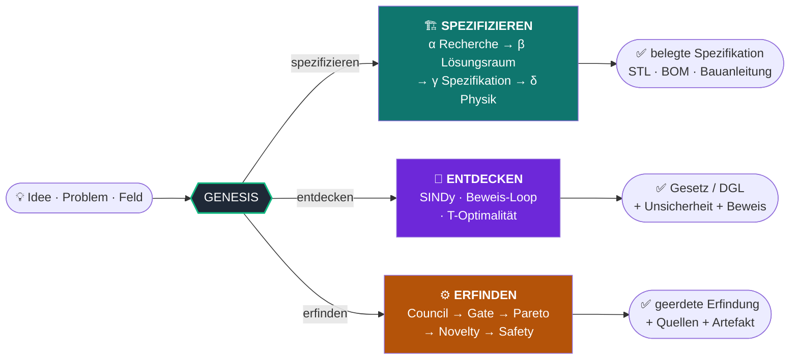
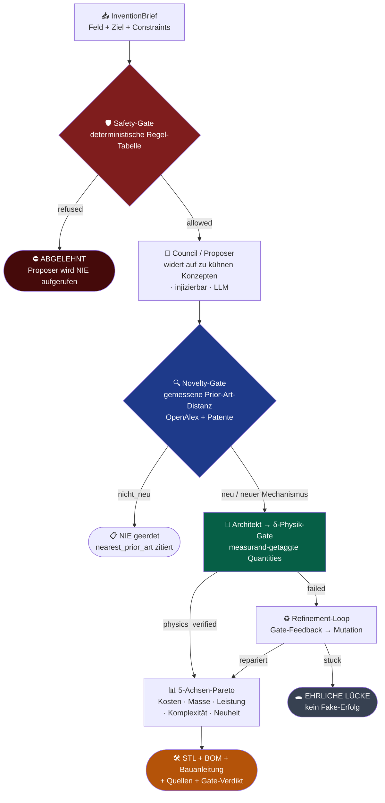
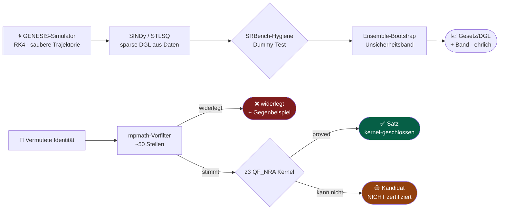
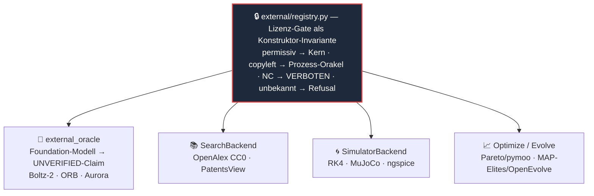

<div align="center">

# 🜔 GENESIS

### *Generative Engine for Networked Ideation, Synthesis & Specification*

**Ein Mensch liefert eine Idee. GENESIS recherchiert, verifiziert, berechnet, simuliert — und liefert eine umsetzbare, belegte Spezifikation. Ohne Halluzination.**

<br/>


<br/>

> **Quellen statt Behauptungen · nachgerechnete Physik statt geratener Zahlen · ehrliche Lücken statt erfundener Antworten.**

</div>

---

```
                          ┌─────────────────────────────────────────────┐
   💡  Idee / Problem ───▶ │   G E N E S I S   ·   Verifizierer-als-Kern   │ ───▶  ✅  Belegte Lösung
       Feld / Frage        │   kein Output ohne Quelle · Gate ist Gesetz   │       STL · BOM · Beweis · Gesetz
                          └─────────────────────────────────────────────┘
```

GENESIS ist eine **Anti-Halluzinations-Maschine**. Der Kern ist nicht der Generator, sondern der **Verifizierer**: jeder faktische Claim lebt in einem Ledger mit Quelle, Confidence und Verifikations-Status; jede Zahl wird nachgerechnet; jede Phase endet erst, wenn ihr **Gate** als harte Code-Bedingung bestanden ist. „Ich weiß es nicht" ist ein gültiger, erwünschter Output.

---

## 📑 Inhalt

- [Die drei Fähigkeiten](#-die-drei-fähigkeiten)
- [Die Garantie (6 Kernprinzipien)](#-die-garantie-6-kernprinzipien)
- [Quickstart](#-quickstart)
- [Der Erfindungs-Loop](#️-der-erfindungs-loop)
- [Der Forschungs-Kern](#-der-forschungs-kern-entdecken--zertifizieren)
- [Die Physik-Engine (Phase δ)](#-die-physik-engine-phase-δ)
- [HORIZONT (φ → Ω)](#-horizont-φ--ω)
- [CLI-Modi](#️-cli-modi)
- [Externe Integration](#-externe-integration-interface-first--lizenz-diszipliniert)
- [Determinismus & ehrliche Grenzen](#-determinismus--ehrliche-grenzen)
- [Projektstruktur](#-projektstruktur)
- [Installation](#-installation)
- [Tests](#-tests)
- [Lizenz](#-lizenz)

---

## 🧭 Die drei Fähigkeiten

GENESIS kann aus einer Idee drei Dinge machen — und lügt in keinem davon:



| | **Spezifizieren** | **Entdecken** | **Erfinden** |
|---|---|---|---|
| **Eingabe** | eine konkrete Idee | Messdaten / eine Vermutung | ein Feld oder Problem |
| **Ausgabe** | druckfertige Spezifikation | ein Gesetz/eine DGL + Unsicherheit | eine neue, geerdete Erfindung |
| **Gate** | δ-Physik + γ-Quellen | z3-Kernel / SINDy-Hygiene | δ-Physik + Novelty + Safety |
| **Halluzination?** | ehrliche Lücke statt Erfindung | „Kandidat" statt „Satz" | über-kühnes Konzept wird abgelehnt |

---

## 🛡️ Die Garantie (6 Kernprinzipien)

> Diese Prinzipien sind als **harte Code-Bedingungen** implementiert, nicht als Stilrichtlinie.

1. **Kein faktischer Output ohne Quelle.** Code, der einen Claim ohne Ledger-Eintrag erzeugt, ist ein Bug — `Claim` ohne Quelle ist nicht konstruierbar.
2. **Verifikation ist ein Gate, kein Vorschlag.** Eine Phase endet erst, wenn ihr Gate als harte Bedingung besteht.
3. **Cross-Model.** Der Verifizierer (`skeptic`) nutzt ein anderes Modell als der Generator. Self-Check zählt nicht.
4. **„Ich weiß es nicht" ist erwünscht.** Refusal/Abstention wird gemessen, nicht bestraft.
5. **Determinismus.** Jeder Lauf hat eine `run_id`, ist gecheckpointet und aus Ledger + Config exakt reproduzierbar.
6. **Stack-Agnostik.** Code gegen Interfaces (`core/interfaces.py`), nie gegen ein Framework. Externes lebt hinter Adaptern.

---

## 🛠️ Development Process: Rigorous Coding Workflow + 12-Agent Council

Genesis is built and evolved using a **self-improving, auditable meta-process** (the Rigorous Coding Workflow) that embodies the same anti-hallucination, gate-first, first-principles spirit at the meta level.

- **4 Fitness Functions** (Simplicity, Security, Verification, Blast Radius) — every change must pass.
- **Living Decision Records** with full provenance, alternatives, risks, and revisit triggers.
- **12-Agent High-Intelligence Council** with mandatory specialization + autonomous research from real user failure reports (Reddit, GitHub, X...).
- **Execution Verification** before "done", loop restraint, context fidelity, anti-bloat.
- All governed by the same strict phases and Harness reviews.

See the living [IMPLEMENTATION_PLAN.md](IMPLEMENTATION_PLAN.md) (added in this integration) for the complete audit trail, decisions, and ongoing evolution of the harness that powers reliable Genesis development.

This meta-layer ensures that the complex, high-stakes Genesis system itself is developed with the same uncompromising standards it enforces on generated specs.

> The builders of Genesis use the rigorous process so that Genesis can help all builders.

---

## 🚀 Quickstart

```bash
# 1. Installieren (Kern ist rein numpy/sympy/scipy/mpmath — keine Cloud, kein GPU nötig)
pip install -e ".[dev]"

# 2. Ein Gesetz aus simulierten Daten ENTDECKEN (SINDy + Hygiene + Unsicherheitsband)
genesis --mode discover-ode
#   → θ̈ = -3.086·θ̇ - 54.48·sin(θ)   R²=1.000000   Dummy ausgeschlossen ✓

# 3. Etwas ERFINDEN (offline-deterministisch; --live schaltet echte LLMs frei)
genesis --mode invent "ein nachgiebiger Greifer"
#   → 2 Konzepte → 2 physik-verifiziert → Pareto-Front + STL/BOM-Bundle

# 4. Eine Idee SPEZIFIZIEREN (Phase α → γ, hinter dem γ-Gate)
genesis --mode spec "Eine rotierende Antriebswelle gegen Torsion und Whirl-Resonanz"

# 5. Einen mathematischen Satz prüfen (mpmath → SymPy → z3-Kernel)
genesis --mode research "(x+1)**2|x**2+2*x+1"
#   → Status: Satz   (kernel-geschlossen via z3 QF_NRA)
```

---

## ⚙️ Der Erfindungs-Loop

Der autonome Erfindungs-Loop trennt sauber den **Proposer** (kühn, fehlbar, ein LLM) vom **Gate** (deterministisch, unbestechlich). Das Gate erweitert, ordnet, verifiziert — **es entscheidet nie außer als Gate.**



**Drei Meilensteine, je durch einen Test belegt:**

| Meilenstein | Beweis |
|---|---|
| **M1** — geerdete Erfindung | freies Feld → ≥1 physik-verifizierte Erfindung mit Quellen + δ-Gate + STL/BOM, reproduzierbar; über-kühnes Konzept → ehrliche Lücke |
| **M2** — rigorose Neuheit | gemessene Prior-Art-Distanz (3 Stufen, *„neuer Mechanismus zählt"*); `nicht_neu` wird **nie geerdet**, jeder Output trägt das Neuheits-Verdikt + Beleg |
| **M3** — Selbst-Reparatur | physik-scheiterndes Konzept wird per Gate-Feedback repariert (30→70→110 Hz → besteht); unreparierbar → ehrlich `stuck=True` |
| **Safety** — First-Class | Waffen-/Bio-Brief wird **vor jeder Konzept-Erzeugung** abgelehnt (mit Spy-Council bewiesen: 0 Proposer-Aufrufe) |

---

## 🔬 Der Forschungs-Kern (Entdecken ≠ Zertifizieren)

Der ehrliche Unterschied zwischen *entdeckt* und *bewiesen* ist in die Labels eingebaut.



- **SINDy** (`discovery/sindy.py`) — STLSQ über eine Funktions-Bibliothek, gespeist aus den eigenen RK4-Simulatoren. Recovered das gedämpfte Pendel `θ̈ = −(c/I)·θ̇ − (mgd/I)·sinθ` maschinengenau (R²=1.0, Dummy-Feature thresholded). *Quelle: Brunton/Proctor/Kutz, PNAS 2016.*
- **Unsicherheit** (`ode_coefficient_bands`) — Ensemble-SINDy-Bootstrap: eng auf sauberen Daten, verbreitert unter Messrauschen. *Quelle: Fasel/Kaiser/Kutz/Brunton/Proctor 2022.* Ehrlich: misst statistische, nicht systematische (FD-Bias-)Unsicherheit.
- **Beweis-Loop** (`discovery/proof_loop.py`) — `(x+1)²=x²+2x+1` → **Satz**; `sin(x)=x` → **widerlegt** (Vorfilter); `(x²+x)/x=x+1` → **widerlegt** (z3 findet `x=0`); `sin²+cos²=1` → **Kandidat** (z3 kann es nicht modellieren — ehrlich NICHT „Satz").
- **T-Optimalität** (`active_resolution.propose_resolution_robust`) — die diskriminierende Messung überlebt den *optimal refitteten* Verlierer: ein Spread schlägt ihn (44.7× Rauschen), ein Einzelpunkt wird absorbiert (1.6×). Form schlägt Punkt.
- **Frontier-Module** (`multiterm` · `transcendental` · `composition` · `multiplicative`) — additive Gesetze mit Out-of-Sample-Validierung; `y = C·f(α·π)+D` über die π-Gruppe mit Power-Law-Rivalen-Gate; Minimal-Korrektur auf dem signierten Residuum (Leave-One-Out → keine Korrektur aus Rauschen); multiplikative Kopplungen `y = C·π1^a·f(α·π2)` (Wien `x³·e^(−x)` exakt rediscovered) + Ratio-Korrektur `y ≈ y_base·m(π)` (gedämpfte Schwingung: `cos(ωt)` exakt aus dem Verhältnis). Insgesamt **36 Discovery-Module**.
- **ProofKernel** (`proof_kernels.py`) — `Z3IdentityKernel` als echte QF_NRA-Entscheidungsprozedur (∀-Identität via UNSAT); `LeanKernelStub` ehrlich als Stub: Transzendentes bleibt **Kandidat**, nie „Satz".
- **Wissensbasis-Quellen** (`tools/codata.py` · `tools/dlmf.py` · `tools/wikidata.py`) — Naturkonstanten (CODATA), mathematische Funktionen (DLMF) und Wikidata als geerdete, ledger-fähige Referenzen für Discovery und Formel-Anker.

---

## 🧱 Die Physik-Engine (Phase δ)

Ein deterministischer **GATE δ-Physik** wählt aus measurand-getaggten Größen automatisch die passenden Closed-Form-/FEM-Validatoren aus und prüft sie gegen geschlossene Formen und Research-Anker.

```
  Statik · Thermik · Modal · Knicken · Ermüdung (Goodman) · Bruch · Torsion · Kontakt · Druck
  Kriechen · Platte · Schraube · Thermospannung · Kerb-Ermüdung
  + 7 Druckbarkeits-Regeln (Überhang · Brücken · erste Lage · Wandstärke …)
  + Flug-Achsen (Rotor-Schwebe · Akku-Flugzeit · ESC-Strombudget · PD-Lageregelung)
  + Roboter-Achsen (Kinematik/IK · Aktuator/Getriebe · Compute-TOPS · Bus-Bandbreite/Latenz)
  + Krypto-Achsen (Geburtstagsschranke · Schlüsselstärke NIST SP-800-57 · GCM-Limit)
```

Eine `Specification` mit measurand-getaggten Quantities feuert die zutreffenden Checks **automatisch** und liefert ein ehrliches Verdikt: **pass · fail · gap** — nie ein stiller Durchlass. Stand heute: **43 Validatoren, 38 Auto-Select-Recipes** (gezählt aus `physics_validation.VALIDATORS` / `physics_selection.RECIPES`). Zwei unabhängige Dynamik-Pfade kreuz-validieren: ein RK4-Vorwärts-Integrator (`simulation/multibody.py`) und PyBullet-Vollkontakt (`simulation/pybullet_sim.py`, inverse Dynamik == Closed-Form maschinengenau).

---

## 🌅 HORIZONT (φ → Ω)

Über α–δ hinaus deckt GENESIS inzwischen den vollen Bogen einer Idee ab — jede Phase mit eigenem deterministischen Gate + Tests (Details: [`docs/HORIZON.md`](docs/HORIZON.md)):

| Phase | Was sie beweist | Status |
|---|---|---|
| **φ · Der Funke** | geerdete Divergenz — keine `Possibility` ohne Ledger-Anker (`agents/forge.py` + `gate_phi`) | ✓ |
| **χ · Die Frontkarte** | belegte Karte des Bekannten + ehrliche Kante des Unbekannten (`gate_chi`) | ✓ |
| **δ⁺ · Realität + Deckung** | Falsifikations-Experiment + echte Messung (`reality.py`); undeklarierter Versagensmodus + Zertifikat (`coverage.py`) | ✓ |
| **γ⁺ · Inverses Design** | Ziel → validierte Pareto-Front statt einer Spec (`inverse_design.py`) | ✓ |
| **ε · Nähte** | verifizierte Kopplung mechanisch↔thermisch↔elektrisch↔Kosten (`seams.py`) | ✓ |
| **ζ · Bindegewebe** | geteiltes, conformal-gegatetes Gedächtnis (`memory_fabric.py`) | ✓ |
| **Ω · Exoskelett** | jeder Output macht den Menschen klüger; Nicht-Lügen als Querfaden (`omega.py`) | ✓ fortlaufend |

Dazu der Grenzverschiebungs-Layer (`src/gen/grenzverschiebung/`, 14 Module — u. a. **LUMENCRUCIBLE**-Selbstverbesserung, Technology-Roadmapper, Experiment-Designer; CLI `--mode breakthrough`) und die App-Integrations-Schicht (`src/gen/integration/`: signierter `audited_run`, Drift-Monitor, Research-Hook). Ehrlich: dieser Layer ist explorativer als der α–δ-Kern.

---

## 🖥️ CLI-Modi

```bash
genesis --mode <modus> "<eingabe>"           # offline-deterministisch (Default)
genesis --mode <modus> "<eingabe>" --live    # echte lokale LLMs / Connectoren (Bonus)
```

| Modus | Was es tut |
|---|---|
| `invent` / `solve` | **Erfindungs-Loop**: Feld/Problem → geerdete, gegatete Erfindung + Artefakt |
| `discover-ode` | **SINDy** aus Sim-Daten + Hygiene-Dummy-Test + Unsicherheitsband |
| `research` | mathematische Identität/Ungleichung: mpmath → SymPy → z3-Kernel (Satz/widerlegt) |
| `report` | Phase α — recherchierte, belegte Fakten zur Frage |
| `solution` | Phase β — der Lösungsraum (Ansätze + Trade-offs) |
| `spec` | Phase γ — vollständige Spezifikation hinter dem γ-Gate |
| `assess` | das Quality-Engine-Verdikt (Klärung + δ-Physik + Constraints + Grounding) |
| `print` | Druckbarkeits-Verdikt (Überhang/Brücken/erste Lage + STL-Mesh-Integrität) |
| `bundle` | vollständiges Bau-Bundle (STL + BOM + Markdown-Bauanleitung) |
| `capstone` | eine komplette γ-Tiefe-Spezifikation durch alle Gates (Demo) |
| `humanoid` / `dream` / `ideas` | komplette Roboter / visionäre Konzepte / zukunftsorientierte Ideen, je gegated |
| `chip` / `training` | Chip-Auswahl-nach-Anforderung · ehrlicher ML-Trainingsplan |
| `feynman` / `campaign` | Rediscovery-Benchmark · Entdeckungs-Kampagne |
| `realize` | volle Realisierungskette über 11 Fach-Pipelines (DFM · Zeichnungen · Regulatorik · Wirtschaft) |
| `section` | Querschnitts-Optimierer (minimales Material unter Last) |
| `council` | Cross-Model-Council (offline-deterministisch, `--live` real) |
| `breakthrough` | HORIZON-Grenzverschiebung (LUMENCRUCIBLE-Layer) |
| `eval` / `protocol` | Eval-Harness (Leaks/False-Alarms) · Protokoll |

---

## 🌐 Externe Integration (interface-first · lizenz-diszipliniert)

Jedes externe Modell/Werkzeug/jede freie API tritt durch **eine Naht** ein und trägt eine **ledger-belegte Lizenz**. Der Kern linkt nur **permissiv** (Apache/MIT/BSD/CC0/CC-BY); **Copyleft** nur als Separat-Prozess-Orakel; **Non-Commercial** ist im kommerziellen Kern **strukturell verboten** (nicht konstruierbar).



| Naht | Offline-Default (Test-Rückgrat) | Externer Eintritt |
|---|---|---|
| **Lizenz-Ledger** | — (Pflicht für alle) | `external_binding()` → VERIFIED-Claim |
| **Externes Orakel** | Fake-Orakel | `ExternalOracle.query()` → **UNVERIFIED**-Claim (nie Roh-Wahrheit) |
| **Such-Backend** | RAG / arXiv | OpenAlex (**live ✓**), PatentsView |
| **Simulator** | RK4-Pendel | MuJoCo (Apache, import-gegated) |
| **Optimierer / Evolve** | Pareto · MAP-Elites | pymoo · OpenEvolve (import-gegated) |

→ Vollständige Karte: [`docs/EXTERNAL_INTEGRATION.md`](docs/EXTERNAL_INTEGRATION.md) — ~80 Modelle/Tools/APIs, je Naht + Lizenz + Status.

---

## ✅ Determinismus & ehrliche Grenzen

GENESIS sagt nie „funktioniert", wenn es nicht verifizierbar ist. Was offline läuft, was opt-in ist, was wirklich BLOCKED ist:

| | Status | Bedeutung |
|---|---|---|
| 🟢 **Kern** | live | numpy/sympy/scipy/mpmath — alles offline-deterministisch, 1992 Tests grün |
| 🟢 **OpenAlex** | live ✓ | CC0-Literatur-Connector, gegen echten Endpoint verifiziert (HTTP 200) |
| 🟡 **pip-opt-in** | nachrüstbar | PySINDy · pymoo · Ax/BoTorch · MuJoCo · OpenEvolve — Adapter gebaut, import-gegated |
| 🔴 **Live-LLM-Council** | B1 BLOCKED | `claude -p` mit dem Council-Prompt > 300s-Timeout → `--live` degradiert *graceful* offline |
| 🔴 **GPU / Julia / Lean / Keys** | Owner-Maschine | PySR · Lean/Goedel · GPU-Foundation-Orakel · paid-Key-APIs — je mit Offline-Zwilling, der die Verdrahtung beweist |

**Determinismus konkret:** `run_clock()` (`core/state.py`) pinnt die Zeit pro Lauf als Context-Var — `now_utc()` liefert überall denselben Instant, Artefakte werden byte-stabil reproduzierbar. **Sicherheit konkret:** `tools/fetch.py`/`http.py` sind SSRF-/DoS-gehärtet (Scheme-Allowlist http/https, `max_bytes`-Cap auf untrusted Bodies — fail-loud statt silent-truncate).

**Weitere ehrliche Grenzen (Stand 2026-07-04):**
- Die Deep-Review-Kampagne (Zeile-für-Zeile, Claude×Grok) läuft noch — einzelne Grok-Cross-Reviews sind nachzuholen; Status-Ledger: `WORK_QUEUE.md`.
- Live-LLM-Läufe (Council, gemessene Ollama-Runs) bleiben owner-gated — kein Real-Use-Ready-Claim ohne Messung.
- Humanoid TP1/TP2 liegen im unmerged Worktree-Branch `worktree-claude-orchestrator`.

---

## 📂 Projektstruktur

```
src/gen/
├── core/            Interfaces, State, Config, Errors (framework-frei)
├── agents/          Agenten (scholar, architect, skeptic …) — je Agent-Protocol
├── ledger/          Fakten-Ledger (mandatory provenance, 3-Schichten-Enforcement)
├── verification/    Gates, Cross-Model-Judging, CEGIS, SMT
├── discovery/       Forschungs-Kern: SINDy · proof_loop · transcendental
│                    · active_resolution (T-Opt) · srbench_hygiene · uncertainty
├── inventor/        Erfindungs-Loop: brief · generate · domains · score · loop
│                    · novelty · archive · refinement · safety · optimize · evolve_engine
├── external/        Lizenz-Ledger (registry) + external_oracle (oracle)
├── tools/           Connectoren (openalex CC0 · patents · codata · dlmf · wikidata)
│                    + fetch/http (SSRF-gehärtet) · RAG · arXiv
├── simulation/      RK4 multibody · PyBullet · SimulatorBackend-Naht
├── physics_*.py     δ-Physik-Engine: 43 Validatoren + 38 Auto-Select-Recipes
├── grenzverschiebung/  HORIZON-Layer: LUMENCRUCIBLE · Roadmapper · Experiment-Designer
├── integration/     App-Integration: signierter audited_run · Drift · Research-Hook
├── proof_kernels.py z3-QF_NRA-Identitäts-Kernel (+ ehrlicher LeanKernelStub)
├── pipelines/       11 Fach-Pipelines (--mode realize): Architekt … Wirtschaft
├── bundle.py        Bau-Bundle-Emitter (STL + BOM + Bauanleitung)
└── cli.py           der CLI-Einstiegspunkt (alle Modi)

tests/               255 Test-Dateien · 1992 passed / 54 skipped / 0 failed (2026-07-04, offline)
docs/                ARCHITECTURE · DATA_MODEL · PIPELINE · phases/ · HORIZON · CAPABILITIES
                     · EXTERNAL_INTEGRATION
```

---

## 📦 Installation

```bash
git clone <repo-url> genesis && cd genesis

# Kern (reicht für discover-ode, research, invent offline, alle δ-Physik-Checks)
pip install -e ".[dev]"

# Optional-Erweiterungen (je nach Bedarf, isoliert)
pip install -e ".[smt]"      # z3-Kernel für den Beweis-Loop
pip install -e ".[sim]"      # PyBullet-Vollkontakt-Dynamik
pip install -e ".[cad]"      # exakte BREP-Geometrie (cadquery/OCP)
pip install -e ".[web]"      # lokale Web-UI (genesis-web)
```

**Voraussetzungen:** Python ≥ 3.11. Kein GPU, kein Cloud-Account, keine API-Keys für den Default-Pfad nötig — GENESIS läuft komplett lokal.

---

## 🧪 Tests

```bash
pytest -q                                      # volle Suite: 1992 passed / 54 skipped / 0 failed
pytest tests/test_inventor_loop.py -q          # der Erfindungs-Loop (M1)
pytest tests/test_discovery_sindy.py -q        # SINDy-Entdeckung
pytest tests/test_external_registry.py -q      # das Lizenz-Gate
```

Jeder Test pinnt **Verhalten** (nicht Implementierung) und enthält mindestens einen Negativtest: was passiert bei fehlender Quelle, Tool-Fehler oder Widerspruch. Ein Gate ohne Test existiert nicht.

---

## 📜 Lizenz

[MIT](LICENSE) — frei nutzbar, auch kommerziell. Externe Anbindungen tragen ihre eigene Lizenz (siehe [`docs/EXTERNAL_INTEGRATION.md`](docs/EXTERNAL_INTEGRATION.md)); der Kern bleibt strikt permissiv.

<div align="center">

<br/>

**GENESIS hält ein einfaches Versprechen:**
### *kühn erfinden, niemals lügen.*

<br/>

*Built deterministically. Verified, not claimed.*

</div>
