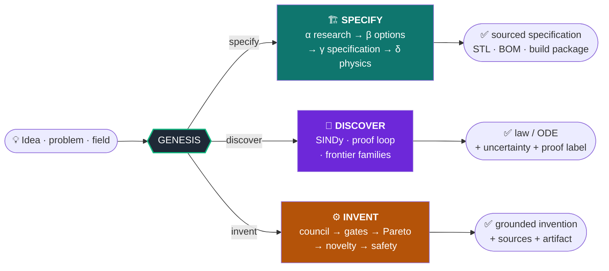
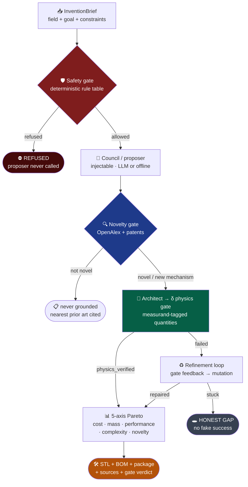
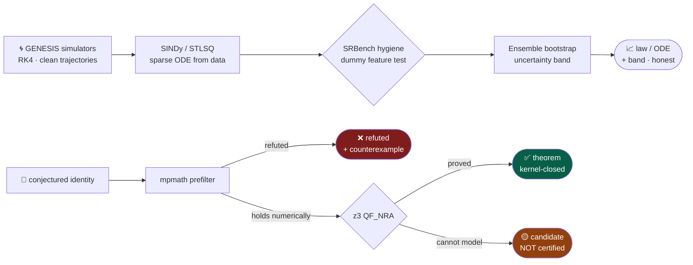

<div align="center">

# GENESIS

### *Generative Engine for Networked Ideation, Synthesis & Specification*

**A human brings an idea. GENESIS researches, verifies, computes, simulates, and packages a buildable, sourced specification — without inventing facts.**

<br/>

[](https://github.com/Oz4462/genesis/actions/workflows/ci.yml)


<br/>

> **Sources over claims · recomputed physics over guessed numbers · honest gaps over invented answers.**

</div>

---

```
                          ┌─────────────────────────────────────────────────┐
   💡 Idea / problem  ───▶│  G E N E S I S  ·  verifier at the core         │───▶  ✅ Sourced solution
      field / question    │  no fact without provenance · gates are law     │      STL · BOM · proof · package
                          └─────────────────────────────────────────────────┘
```

GENESIS is an **anti-hallucination engine**. The center of gravity is not the generator — it is the **verifier**: every factual claim lives in a ledger with sources, confidence, and verification status; every number is recomputed; every phase ends only when its **gate** (hard code, not a prompt) passes. *“I don’t know”* is a valid, preferred outcome.

| Document | Role |
|----------|------|
| [`docs/STATUS.md`](docs/STATUS.md) | Living product truth (L0–L4 depth) |
| [`docs/HORIZON.md`](docs/HORIZON.md) | HORIZON φ→Ω honest levels |
| [`docs/BACKLOG_TODO_PLAN.md`](docs/BACKLOG_TODO_PLAN.md) | Sequential sprint checklist |
| [`docs/SYSTEMATIC_BACKLOG_REPORT_2026-07-15.md`](docs/SYSTEMATIC_BACKLOG_REPORT_2026-07-15.md) | Full evidence-based backlog report |
| [`docs/CADQUERY_VENV.md`](docs/CADQUERY_VENV.md) | Isolated CadQuery venv (PEP 668) |
| [`docs/integration/PRINTFORGE_INVENTORY.md`](docs/integration/PRINTFORGE_INVENTORY.md) | Manufacturing competence map |

---

## Table of contents

1. [What’s new (2026-07 campaign)](#1-whats-new-2026-07-campaign)
2. [Three capabilities](#2-three-capabilities)
3. [Six guarantees (hard code)](#3-six-guarantees-hard-code)
4. [Quickstart](#4-quickstart)
5. [Invention loop](#5-invention-loop)
6. [Research & discovery core](#6-research--discovery-core)
7. [Physics engine (phase δ)](#7-physics-engine-phase-δ)
8. [HORIZON arc (φ → Ω)](#8-horizon-arc-φ--ω)
9. [Manufacturing & PRINTFORGE-native stack](#9-manufacturing--printforge-native-stack)
10. [Realization packages](#10-realization-packages)
11. [Knowledge, live sources & memory](#11-knowledge-live-sources--memory)
12. [Platform caps](#12-platform-caps)
13. [CLI modes (detailed)](#13-cli-modes-detailed)
14. [External integration & license discipline](#14-external-integration--license-discipline)
15. [Determinism, offline demos & honest limits](#15-determinism-offline-demos--honest-limits)
16. [Project structure](#16-project-structure)
17. [Installation](#17-installation)
18. [Tests & CI](#18-tests--ci)
19. [Development process](#19-development-process)
20. [License](#20-license)

---

## 1. What’s new (2026-07 campaign)

A full **Phase A→F** product campaign closed major seams. Everything below is **in `main`**, covered by tests and green GitHub Actions (Python 3.11 + 3.12).

### Phase A — HORIZON trust

| Change | Detail |
|--------|--------|
| **Import split** | One missing symbol (`derive_goal_from_spec`) had nulled *all* HORIZON builders; imports are now per-module. |
| **Subgates attach** | ε seams, ζ memory fabric, γ⁺ Pareto, δ⁺ coverage, Ω — no longer silent `None` on normal dreams. |
| **`enforce_omega=True`** | Default: failed/absent Ω raises `OmegaGateNotPassed` (OM-4). Opt out only via `enforce_omega=False`. |
| **Ω receipts** | `OmegaCertificate.gate_receipts` includes ε/ζ/γ⁺/coverage + pre-gate with evidence notes. |
| **δ⁺ fixtures** | `process_dream(..., measurement_fixture=path\|dict)` → real `Measurement` + `evaluate_reality`; without fixture stays **inconclusive** (never invents a matching reading). |
| **Docs honesty** | STATUS/HORIZON use L0–L4; no “complete” without evidence. |

### Phase B — Manufacturing (PRINTFORGE-native)

| Change | Detail |
|--------|--------|
| **CNC DFM** | `resolve_cnc_material_class` + `evaluate_cnc_wall` — metal vs plastic min-wall from `material_hint`. |
| **PCB layout** | Optional `pcb_layout={...}` on `check_advanced_dfm` evaluates fab rules; mechanical-only stays all-gaps. |
| **Cost models** | `estimate_cnc_cost`, `estimate_laser_cost` ranged bands + CAM/path gaps (plus existing FDM). |
| **G-code** | Outside profile, rectangular pocket, **face mill** — verified RS-274 structure. |
| **CadQuery bridge** | Isolated `.venv-cad`; bridge only if `cad_available()` — **CI-safe** without laptop paths. |

### Phase C — Realization package

| Artifact | Schema / meaning |
|----------|------------------|
| `bom.json` / `BOM.md` | `genesis-bom-v1` — mechanical + electronic lines, counts, gaps |
| `harness_package.json` / `HARNESS.md` | Harness + netlist + placement + honest gaps |
| `drawings.json` / `DRAWINGS.md` | Drawing index + real top/front/right DXF sections with overall envelope dimensions when CSG exists; **`drawing_gap: false`** then — full GD&T frames/PDF still an explicit gap |
| Module | `gen.pipelines.realization_package` wired into `build_full_mini_realization_package` |

### Phase D — Live knowledge

| Feature | Detail |
|---------|--------|
| **`genesis --mode sources`** | Full connector catalog: search backends, wissensbasis, ledger, vector |
| **Community evidence** | Agent-sourced OpenAlex; `user_data_required=False` — **no user JSON ledger** |
| **PatentsView** | Wired only with `PATENTSVIEW_API_KEY`; status `key_missing` otherwise |
| **Electronics seeds** | ESC, buck, CAN-FD + **improvement recipes** (thermal pad, IPC-2221 trace) |
| **Ledger / vector** | Postgres via `GENESIS_PG_DSN`; vector = local anamnesis vendor — production Qdrant **not claimed** |

### Phase E — Simulation & caps

| Feature | Detail |
|---------|--------|
| **`genesis --mode caps`** | Matrix: which CLI modes surface proof / readiness / teacher / community |
| **`genesis --mode multi-physics`** | Closed-form receipt: \(P \to \Delta T = P R_{th}\) + Euler–Bernoulli tip |
| **Reference cases** | Expanded (thermal RC, ohmic power, plate bending, …) |
| **Mesh fixture** | `analytical_mesh_series_case` for honest mesh_convergence demos |
| **Bundle MANIFEST** | Caps fields: `proof_package`, `readiness_level`, `teacher_notes_present`, `community_score`, `caps_present`, `caps_gaps` |

### Phase F — Cleanup & learning

| Feature | Detail |
|---------|--------|
| **Doc drift** | Stale “fracture NotImplemented” claims corrected |
| **Learning integrator** | Mines real `safety.stages` + `revised.revisions` |
| **`run_grenz_learning_loop`** | front → frontier → revise → safety → delta → feed |
| **`revise_with_learning`** | Closes loop; **never** upgrades Grenztypen without verified evidence |

---

## 2. Three capabilities



| | **Specify** | **Discover** | **Invent** |
|---|---|---|---|
| **Input** | a concrete idea | measurements / a conjecture | a field or problem |
| **Output** | print-ready / packageable specification | a law or ODE + uncertainty band | a grounded invention |
| **Gate** | δ physics + γ sources | z3 kernel / SINDy hygiene | δ physics + novelty + safety |
| **If stuck** | honest gap in the package | “candidate”, never fake “theorem” | refuse over-bold concepts |

---

## 3. Six guarantees (hard code)

These are **enforced in constructors and gates**, not style guides:

1. **No factual output without a source.** A `Claim` without provenance cannot be built (`UnsourcedClaimError`).
2. **Verification is a gate, not a suggestion.** A phase ends only when its gate result is `passed`.
3. **Cross-model.** Live skeptic uses a different model family from the generator (`assert_different_families`).
4. **Abstention is success.** Refusal / “I don’t know” is measured and preferred over fabrication.
5. **Determinism.** Every run has a `run_id`; offline demos are scripted; live is opt-in.
6. **Stack-agnostic core.** Code against `core/interfaces.py`; cloud and CAD kernels live behind adapters.

Additional product laws:

- **No invented lab measurements.** δ⁺ is inconclusive until a retrieved `Measurement` exists.
- **No user-supplied community ledger required.** Public literature is agent-fetched (OpenAlex).
- **Completion cannot hide a failed Ω gate** when enforcement is on (default).

---

## 4. Quickstart

```bash
# Clone and install core + test tools + SMT
git clone https://github.com/Oz4462/genesis.git
cd genesis
python3.11 -m venv .venv && source .venv/bin/activate   # Windows: .venv\Scripts\activate
pip install -e ".[dev,smt]"
export PYTHONPATH=src

# Discover a law from simulated data (SINDy + hygiene)
genesis --mode discover-ode

# Invent (offline-deterministic; --live enables real LLMs)
genesis --mode invent "a compliant gripper"

# Specify / assess / package
genesis --mode assess --demo
genesis --mode bundle --demo

# Full HORIZON arc (Ω enforced)
genesis --mode horizon-full "steel bracket for 100 N"

# Operator surfaces
genesis --mode sources          # connector health
genesis --mode caps             # platform caps matrix
genesis --mode multi-physics    # elec→thermal + beam tip receipt

# Realization package (multi-idea → BOM + harness + drawings index)
genesis --mode realize "jetpack tether test stand"
```

Optional CadQuery (exact BREP) — **never** install into the main venv (numpy pin risk):

```bash
# See docs/CADQUERY_VENV.md
export GENESIS_CAD_PYTHON="$HOME/.venv-cad/bin/python"
```

Live backends (optional):

```bash
export GENESIS_ALLOW_LIVE=1
export PATENTSVIEW_API_KEY=...   # only if you want patent prior-art search
export GENESIS_PG_DSN=postgresql://...  # optional persistent ledger
```

---

## 5. Invention loop

The autonomous invention loop cleanly separates a **proposer** (bold, fallible, optionally LLM) from **gates** (deterministic, incorruptible). The gate extends, ranks, and verifies — **it never invents facts**.



### Milestones (test-backed)

| Milestone | Proof |
|-----------|--------|
| **M1** — grounded invention | Free field → ≥1 physics-verified invention with sources + δ gate + STL/BOM path; over-bold concept → honest gap |
| **M2** — rigorous novelty | Measured prior-art distance; `not_novel` is **never grounded**; nearest prior art is cited |
| **M3** — self-repair | Failing physics concept refined via gate feedback; irreparable → honest `stuck` |
| **Safety first-class** | Weapons/bio briefs refused **before** any proposer call |

### Scoring (γ⁺ bridge)

`inventor.score` maps five axes into a HORIZON `ParetoFront` with **recomputable** quantity stamps (`inventor.score_recomputable`) so inverse-design objectives recompute the same numbers — not opaque proxy scores alone.

Thermal invent uses material-aware conductivity (e.g. copper \(k=401\), aluminum \(k=205\)) from the materials registry.

---

## 6. Research & discovery core

The honest difference between *discovered* and *proved* is baked into labels.



### Discovery stack (selected)

| Module | Role |
|--------|------|
| `discovery/sindy.py` | STLSQ over function libraries; e.g. damped pendulum recovered at R²≈1 with dummy features thresholded |
| Uncertainty bands | Ensemble-SINDy bootstrap — statistical, not systematic FD bias |
| `discovery/proof_loop.py` | Identity proving: theorem / refuted / candidate |
| Frontier 6.x | Multiterm, transcendental, composition, multiplicative, blind products, additive arguments, GP open-form (Occam ladders, OOS gates) |
| `ExplorationController` | Budgeted multi-problem discovery campaigns |

**Law:** z3 limits produce **candidates**, never silent promotion to “theorem”.

### Phase α research path

Scout → scholar → skeptic on real backends (or offline demos). Scholar quote-checks claims against fetched text (NFKC-normalized). Materials emit separate **density** and **thermal conductivity** claims so α can verify ρ and \(k\) independently. Wikidata P2054 densifies live copper/steel paths (e.g. copper VERIFIED against materials registry + Wikidata).

---

## 7. Physics engine (phase δ)

Deterministic validators and auto-selected check recipes over a built `Specification`:

- **Validators** — statics, contact, plate, fracture (Paris law including **m = 2** closed form), fatigue, thermal, creep recipes, Monte Carlo product checks, etc.
- **Auto-select** — `physics_selection` maps brief keywords / domains to recipes; `MANUAL_ONLY` remains only where no closed form exists (e.g. full-formula Monte Carlo uncertainty).
- **Assessment** — clarification + δ-physics + constraints + grounding + platform caps (proof package, readiness TRL, teacher notes, community evidence).

Assessment and invent paths attach **TeacherMode** and **community_evidence** (agent OpenAlex when live).

---

## 8. HORIZON arc (φ → Ω)

HORIZON is the cross-phase **completion and honesty** stack. Entry points:

| Entry | Command / API |
|-------|----------------|
| Dream / LUMEN | `genesis --mode dream` · `process_dream(raw_dream)` |
| Full orchestration | `genesis --mode horizon-full "…"` · `run_full_horizon` |
| Caps matrix | `genesis --mode caps` |

### Layers

| Layer | Symbol | What it proves | Default depth |
|-------|--------|----------------|---------------|
| Seams | **ε** | Cross-domain seam certificate + `gate_epsilon` | L3 wired |
| Memory fabric | **ζ** | Deposits of VERIFIED claims + `gate_zeta` | L3 wired |
| Inverse design | **γ⁺** | Pareto front over design candidates | L3 wired |
| Reality | **δ⁺** | Falsification experiment; optional measurement | L2–L3 |
| Coverage | **δ⁺ cov** | Reviewed failure modes certificate | L3 wired |
| Omega | **Ω** | Cross-phase decision sheet; failed gates cannot hide | L3 **enforced** |

### Enforcement contract

```python
from gen.grenzverschiebung.lumencrucible import process_dream

# Default: enforce_omega=True → OmegaGateNotPassed if Ω fails or is missing
out = process_dream("steel bracket 100 N", work_queue_path="out/wq.md")

# With independent lab-like fixture (never invent the reading):
out = process_dream(
    "steel bracket 100 N",
    measurement_fixture={"value": 1.0, "unit": "1", "source": "fixture:lab-1"},
)

# Partial demos only:
out = process_dream("…", enforce_omega=False)
```

Typical return keys: `hammer`, `omega_certificate`, `omega_gate`, `horizon_subgates`, `memory_fabric`, `seam_certificate`, `coverage_certificate`, `pareto_front`, `reality_verdict` / `delta_plus_result`, `teacher_notes`, `community_evidence`, `claim`, `self_improvement`.

### Learning loop (Grenzverschiebung)

```text
map_development_front → watch_frontier → revise_boundary
  → build_safety_ladder → apply_learning_cycle → apply_delta_to_front
```

- Verified frontier evidence may upgrade Grenztypen.  
- Synthetic items only create **candidates** (old_typ == new_typ).  
- Learning extracts real stage criteria and revisions (not only the dream string).

---

## 9. Manufacturing & PRINTFORGE-native stack

There is **no external PRINTFORGE product** on this machine; GENESIS implements manufacturing competence natively (inventory: [`docs/integration/PRINTFORGE_INVENTORY.md`](docs/integration/PRINTFORGE_INVENTORY.md)).

### Modules

| Module | Responsibility |
|--------|----------------|
| `cad/prototype_cad_builder.py` | Parametric prototype specs + code emit |
| `brep.py` + `cad/cadquery_bridge.py` | Exact OCCT volume/valid/interfere/STL via isolated interpreter |
| `cad/manufacturing_check.py` | Base printability + **advanced multi-process DFM** |
| `dfm.py` | FDM / CNC / laser / PCB constants, geometric gaps, PCB layout evaluation |
| `cad/cost_model.py` | FDM + CNC + laser ranged cost estimates |
| `cad/gcode.py` | Profile, rect pocket, face mill + `verify_gcode` |
| `cad/kicad.py` | Netlist / schematic skeleton exports (full copper DRC remains external seam) |
| `electronics.py` | Rich MNA/transient/EMI, harness, placement, internal DRC, KiCad export |

### Advanced DFM processes

| Process | What is evaluated | What is a gap |
|---------|-------------------|---------------|
| **FDM** | Min wall, volume heuristics, printability notes | Hole diameters without feature CSG |
| **CNC** | Material-aware min wall (metal/plastic) | Corner radius, pocket aspect, hole depth:d, envelope |
| **Laser** | Sheet thickness vs industrial/shop caps | In-plane form, kerf, feature ratios |
| **PCB** | Full rules if `pcb_layout` summary provided | Entire DRC if only a mechanical solid |

```python
from gen.cad.manufacturing_check import check_advanced_dfm

report = check_advanced_dfm(artifact)  # uses spec.material_hint
report = check_advanced_dfm(
    artifact,
    pcb_layout={
        "min_trace_mm": 0.15,
        "min_spacing_mm": 0.15,
        "via_drill_mm": 0.3,
        "annular_ring_mm": 0.15,
        "copper_to_edge_mm": 0.35,
        "board_thickness_mm": 1.6,
    },
)
```

### G-code

```python
from gen.cad.gcode import (
    generate_profile_gcode,
    generate_rect_pocket_gcode,
    generate_face_mill_gcode,
    verify_gcode,
)

prog = generate_face_mill_gcode(100, 60, face_depth_mm=0.5)
assert verify_gcode(prog).ok
```

Feeds/speeds are **stated assumptions**, not material-specific CAM. Multi-axis freeform remains a gap.

---

## 10. Realization packages

`build_full_mini_realization_package(ideas, …)` / CLI `realize` writes under `out/realization_packages/…`:

| File | Meaning |
|------|---------|
| `manifest.json` | Package metadata, DFM, fertigungs, **structured BOM**, caps, physics_gate honesty |
| `bom.json` / `BOM.md` | Mechanical + electronic lines (`genesis-bom-v1`) |
| `harness_package.json` / `HARNESS.md` | Harness + netlist + placement + gaps |
| `drawings.json` / `DRAWINGS.md` | Drawing index; real dimensioned DXF sections when geometry exists (`drawing_gap` honest) |
| `part_*.stl`, assembly STLs | Geometry when CAD path succeeds |
| `electronics_*.json` | Elektriker layer when available |
| `SUMMARY.md`, `REGULATORIK.md`, `SCHALTPLAN.md`, `MONTAGEANLEITUNG.md` | Human-readable package docs |

**Important:** idea/fragment packages are **manufacturing artifact bundles**. The deterministic δ-physics gate is **not** run without a full `Specification` — the manifest states this and points to `--mode bundle` / `--mode assess`.

---

## 11. Knowledge, live sources & memory

### Source catalog

```bash
genesis --mode sources
GENESIS_SOURCES_JSON=1 genesis --mode sources
```

Implemented in `gen.tools.source_catalog`:

| Connector | Key? | Notes |
|-----------|------|--------|
| Wikipedia | no | Keyless |
| Materials registry | no | Offline grounded |
| Wikidata density | no | P2054 independent density |
| Semantic Scholar | optional | Rate limits without key |
| arXiv | no | Atom API |
| **OpenAlex** | no | CC0 scholarly graph · invent + community |
| **PatentsView** | **yes** | `PATENTSVIEW_API_KEY` or status `key_missing` |
| Formula / CODATA / DLMF | no | Formula backend |
| Wissensbasis connectors | no | arxiv, components, materials, suppliers, internal actuators |
| Postgres ledger | `GENESIS_PG_DSN` | Else in-memory |
| Vector memory | — | Local anamnesis vendor; production Qdrant **false** |

### Community evidence (not a user form)

```python
from gen.grenzverschiebung.readiness_ladder import community_evidence

ev = community_evidence({"idea": "compliant gripper FDM"}, live=True)
# agent_sourced=True, user_data_required=False
# literature_hits from OpenAlex when live; score capped for literature-only
```

Optional `out/community_ledger.json` is an **agent cache**, never a human homework form.

### Memory fabric (ζ)

`build_memory_fabric_certificate` deposits **VERIFIED** claims only; empty fabric is valid abstention; recalls require conformal calibration health.

---

## 12. Platform caps

Four caps surface across the product:

| Cap | Meaning |
|-----|---------|
| **ProofPackage** | On-disk proof package directory for a run |
| **ReadinessLadder** | TRL-style level from evidence in the package |
| **TeacherMode** | Learning notes that make the human smarter |
| **CommunityEvidence** | Public literature / field feedback scores |

```bash
genesis --mode caps
# full-caps modes typically: assess, bundle, realize, humanoid
```

Bundle `MANIFEST.json` includes caps fields so partial packages cannot silently omit them.

---

## 13. CLI modes (detailed)

Run `genesis --help` for the full choice list. Selected modes:

### Research & math

| Mode | Purpose |
|------|---------|
| `report` | Phase α research report (default) |
| `research` | Math identity / research path |
| `solution` | Phase β solution space |
| `spec` | Phase γ specification |
| `goldset` | Anti-hallucination measurement harness |
| `divergence` | Phase φ possibility space (live backends) |
| `frontier` | Phase χ frontier map offline |

### Product & packages

| Mode | Purpose |
|------|---------|
| `assess` | Clarification + δ-physics + caps |
| `bundle` | Full deliverable bundle + MANIFEST |
| `print` | Printability / mesh integrity |
| `realize` | Multi-fragment realization package |
| `capstone` | Gated demo specification |

### Invent & invent-adjacent

| Mode | Purpose |
|------|---------|
| `invent` | Invention loop |
| `council` | Multi-model council (offline default; `--live` for real CLIs) |
| `ideas` / `dream` | Idea / LUMEN dream path |
| `horizon-full` | LUMEN + deep discovery + grenz cluster |

### Physics, robotics, domain

| Mode | Purpose |
|------|---------|
| `structural` | Structural demos |
| `humanoid` / `aethon` | Humanoid research + sim gates |
| `section` / `topology` / `training` / `chip` | Domain tooling modes |
| Fach: `architekt` … `wirtschaft` | Discipline pipelines |

### Operator / meta

| Mode | Purpose |
|------|---------|
| `sources` | Connector catalog health |
| `caps` | Platform caps matrix |
| `multi-physics` | Co-design receipt |
| `well-probe` | The Well stream probe (no 15 TB download) |
| `breakthrough` | Breakthrough / frontier demos |
| `discover-ode` | SINDy discovery demo |

### Flags

| Flag | Meaning |
|------|---------|
| `--demo` | Offline scripted models + canned sources |
| `--live` | Real Grok/Claude (or other configured) CLIs where supported; enables live community for horizon-full |
| `--generator` / `--verifier` | Model ids (defaults: grok-4.5 / claude-opus-4-8 via CLIs) |
| `--format` | `text` · `md` · `scad` · `b123d` · `stl` for spec export |

---

## 14. External integration & license discipline

External models, tools, and datasets register through `gen.external.registry`:

- **Permissive** (MIT/Apache/BSD/CC0/…) → may link into the core.  
- **Copyleft** (GPL/AGPL/LGPL) → **process boundary only** (`IntegrationMode.PROCESS`).  
- **Non-commercial** → **forbidden** in the commercial core.  
- **Unknown license** → refused (no silent default to permissive).

Bindings become VERIFIED ledger claims with provenance for auditability.

Search backends implement `SearchBackend`: discovery only (candidates unfetched until scholar retrieves them); id-less rows are skipped; transport failures raise `SearchBackendError` (loud).

---

## 15. Determinism, offline demos & honest limits

### Determinism

- Offline demos use `ScriptedLLM` + canned HTTP — byte-stable for CI.  
- Live runs are opt-in (`GENESIS_ALLOW_LIVE`, `--live`).  
- Config and model ids enter the run hash for reproducibility of the offline path.

### CadQuery / CI

CadQuery is **not** in the main `.venv` (numpy downgrade risk). Exact BREP uses:

1. In-process cadquery if somehow present, else  
2. Isolated interpreter when `cad_available()` (env `GENESIS_CAD_PYTHON` or default path if it exists), else  
3. GeometryError / AABB-only layers / monkeypatched unit tests.

CI has no laptop `.venv-cad` — tests that stub OCCT force the offline path.

### Honest limits (not claimed)

| Topic | Status |
|-------|--------|
| Multi-axis freeform CAM | Open |
| Full GD&T feature-control frames / multi-sheet PDF | Open (H1: overall envelope dims + right view on DXF sections; `drawing_gap` false when sections exist) |
| Production Qdrant / pgvector cluster | Not wired |
| Private lab field replications | Cannot invent |
| The Well 15 TB bulk | Stream/probe only |
| Trustcore private companion | Optional, not required |

Depth is tracked as **L0 (doc) → L4 (production sign-off)** in STATUS. “Wired” ≠ “factory certified.”

---

## 16. Project structure

```
genesis/
├── src/gen/
│   ├── agents/              # scout, scholar, skeptic, architect, conductor, …
│   ├── tools/               # OpenAlex, arXiv, patents, materials, Wikidata, source_catalog
│   ├── verification/        # gates, geometry, SMT, trustcore adapter, …
│   ├── cad/                 # DFM, G-code, cost, kicad, cadquery_bridge + worker
│   ├── grenzverschiebung/   # LUMENCRUCIBLE, readiness, learning, boundary, safety
│   ├── inventor/            # brief, novelty, score, domains (thermal, mechatronics)
│   ├── discovery/           # SINDy, frontier, proof_loop, controller
│   ├── pipelines/           # integrator, realize, fach pipelines, realization_package
│   ├── simulation/          # runner, multi_physics_receipt, mesh gates, co-sim
│   ├── electronics.py       # circuit/electronics layer
│   ├── physics_validation.py / physics_selection.py
│   ├── bundle.py            # emit_bundle + MANIFEST caps
│   ├── platform_caps.py     # caps matrix + extract_caps_snapshot
│   ├── horizon_full.py      # horizon-full orchestration
│   ├── memory/              # verified facts + anamnesis vendor
│   ├── ledger/              # in-memory + postgres
│   ├── wissensbasis/        # recipes, connectors, seeding
│   ├── web/                 # optional FastAPI UI
│   └── cli.py               # genesis entrypoint
├── tests/                   # large offline suite
├── docs/                    # STATUS, HORIZON, backlog, phase docs, …
├── scripts/                 # self_improve_smoke, postgres_smoke, setup_cadquery_venv
├── sql/001_ledger.sql
├── pyproject.toml
└── README.md
```

---

## 17. Installation

```bash
# Minimum (core + tests + ruff + z3)
pip install -e ".[dev,smt]"

# Optional extras
pip install -e ".[web]"        # FastAPI UI: genesis-web
pip install -e ".[postgres]"   # asyncpg ledger
pip install -e ".[sim]"        # pybullet (tests skip if missing)
# [cad] / [b123d] — prefer isolated envs; see CADQUERY_VENV.md
```

| Extra | Provides |
|-------|----------|
| `dev` | pytest, ruff, httpx, hypothesis, … |
| `smt` | z3-solver |
| `web` | fastapi, uvicorn |
| `postgres` | asyncpg |
| `sim` | pybullet |
| `full` | all optional groups |

**Python:** ≥ 3.11  
**Core deps:** numpy, sympy, scipy, mpmath, pydantic  

Console scripts: `genesis`, `genesis-web`.

---

## 18. Tests & CI

```bash
export PYTHONPATH=src
pytest -q
ruff check .

# Focused product smoke (offline)
bash scripts/self_improve_smoke.sh
```

### GitHub Actions

Workflow: [`.github/workflows/ci.yml`](.github/workflows/ci.yml)

| Step | Matrix |
|------|--------|
| Install `.[dev,smt]` | Python **3.11**, **3.12** |
| `ruff check .` | both |
| `pytest -q` | both |

Optional CAD/sim packages are not installed in CI — related tests honest-skip or use stubs.

---

## 19. Development process

GENESIS itself is evolved under an anti-hallucination meta-process:

- **Fitness functions** — simplicity, security, verification, blast radius  
- **Evidence-first** — STATUS and backlog require commit + test anchors  
- **Structured loops** — research → plan → implement → review  
- **Multi-agent council** patterns for high-stakes product decisions  
- **No overclaim** — first-stone ≠ production; L-levels in STATUS  

See [`IMPLEMENTATION_PLAN.md`](IMPLEMENTATION_PLAN.md) and campaign docs under `docs/` for audit trails.

---

## 20. License

MIT — see [LICENSE](LICENSE).

---

<div align="center">

### Sources · Gates · Gaps · Reproducibility

**Build it. Verify it. Ship only what the ledger can defend.**

<br/>

[Documentation](docs/STATUS.md) · [Actions](https://github.com/Oz4462/genesis/actions) · [Issues](https://github.com/Oz4462/genesis/issues)

</div>
