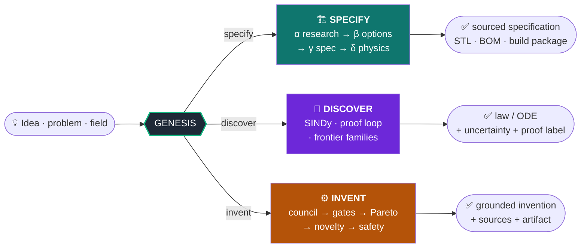
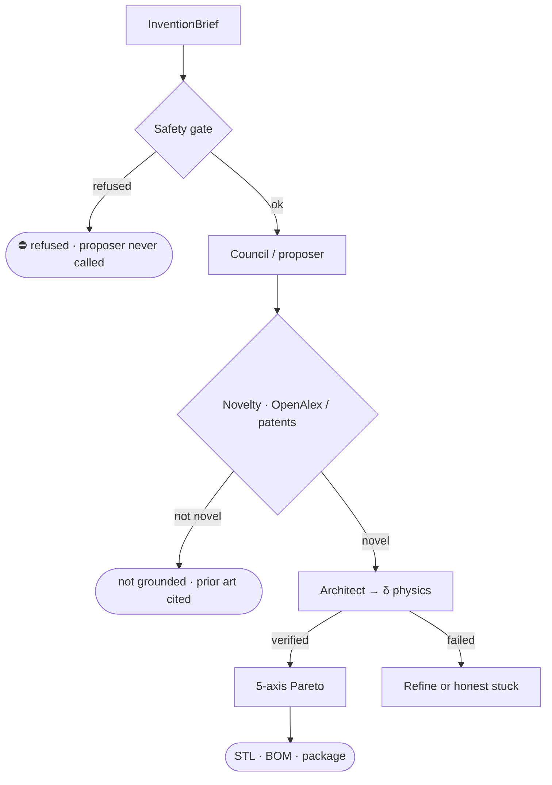

<div align="center">

# GENESIS

### *Generative Engine for Networked Ideation, Synthesis & Specification*

**A human brings an idea. GENESIS researches, verifies, computes, and packages a buildable, sourced specification — without inventing facts.**

<br/>

[](https://github.com/Oz4462/genesis/actions/workflows/ci.yml)


<br/>

> **Sources over claims · recomputed physics over guessed numbers · honest gaps over invented answers.**

</div>

---

```
                     ┌──────────────────────────────────────────────────┐
  💡 Idea / problem  │  G E N E S I S  ·  verifier at the core          │  ✅ Sourced output
     field / question│  no fact without provenance · gates are law      │     STL · BOM · proof
                     └──────────────────────────────────────────────────┘
```

GENESIS is an **anti-hallucination engine**. The center of gravity is not the generator — it is the **verifier**: every factual claim lives in a ledger with sources and status; every number is recomputed; every phase ends only when its **gate** (hard code, not a prompt) passes. *“I don’t know”* is a valid, preferred outcome.

**Living product truth:** [`docs/STATUS.md`](docs/STATUS.md) · **Backlog:** [`docs/BACKLOG_TODO_PLAN.md`](docs/BACKLOG_TODO_PLAN.md) · **Deep report:** [`docs/SYSTEMATIC_BACKLOG_REPORT_2026-07-15.md`](docs/SYSTEMATIC_BACKLOG_REPORT_2026-07-15.md)

---

## Contents

- [What’s new (2026-07)](#-whats-new-2026-07)
- [Three capabilities](#-three-capabilities)
- [Six guarantees](#-six-guarantees)
- [Quickstart](#-quickstart)
- [CLI modes](#️-cli-modes)
- [HORIZON arc (φ → Ω)](#-horizon-arc-φ--ω)
- [Manufacturing & realization](#-manufacturing--realization)
- [Knowledge & live sources](#-knowledge--live-sources)
- [Invention & discovery](#️-invention--discovery)
- [Install](#-install)
- [Tests & CI](#-tests--ci)
- [Project layout](#-project-layout)
- [Honest limits](#-honest-limits)
- [License](#-license)

---

## ✨ What’s new (2026-07)

A full **A→F campaign** closed major product seams. Highlights:

| Area | Improvements |
|------|----------------|
| **HORIZON** | Subgates ε / ζ / γ⁺ / coverage / Ω actually attach (import split fix). **`enforce_omega=True` by default.** Ω receipts include all subgates. δ⁺ measurement fixtures for real corroboration; no fake readings. |
| **Manufacturing** | Material-aware **CNC DFM**; optional **PCB layout** checks; **CNC/Laser cost ranges**; **face-mill GCode** + profile/pocket; CadQuery via **isolated venv bridge** (CI-safe). |
| **Realization package** | Structured **BOM** (`genesis-bom-v1`, mech + elec); **harness / netlist / placement** section; **drawing index** with explicit `drawing_gap`. |
| **Live knowledge** | `genesis --mode sources` connector catalog; agent-sourced **OpenAlex** community evidence (no user ledger); PatentsView **key-gated honestly**; ledger/vector status without overclaim. |
| **Platform caps** | `genesis --mode caps` matrix; multi-physics receipt; bundle **MANIFEST** surfaces proof / readiness / teacher / community. |
| **Learning loop** | Safety stages + boundary revisions extracted into learning deltas; `revise_with_learning` closes the loop without fake Grenztyp upgrades. |
| **CI** | GitHub Actions green on **Python 3.11 + 3.12** (ruff + full pytest). |

---

## 🧭 Three capabilities



| | **Specify** | **Discover** | **Invent** |
|---|---|---|---|
| **Input** | a concrete idea | data / a conjecture | a field or problem |
| **Output** | buildable specification | law / ODE + uncertainty | grounded invention |
| **Gate** | δ physics + γ sources | z3 / SINDy hygiene | δ + novelty + safety |
| **If stuck** | honest gap | “candidate”, not “theorem” | refuse over-bold concepts |

---

## 🛡️ Six guarantees

Implemented as **hard code**, not style guidelines:

1. **No factual output without a source.** A `Claim` without provenance cannot be constructed.
2. **Verification is a gate, not a suggestion.** A phase ends only when its gate passes.
3. **Cross-model by default.** Generator and skeptic use different model families when live.
4. **Abstention is success.** Refusal is measured and preferred over fabrication.
5. **Determinism.** Runs carry `run_id`, checkpoints, and reproducible offline demos.
6. **Stack-agnostic core.** Code against `core/interfaces.py`; externals live behind adapters.

---

## 🚀 Quickstart

```bash
# 1. Core install (numpy/sympy/scipy/mpmath — offline, no GPU required)
git clone https://github.com/Oz4462/genesis.git
cd genesis
python3.11 -m venv .venv && source .venv/bin/activate
pip install -e ".[dev,smt]"

# 2. Discover a law from simulated data (SINDy + hygiene)
genesis --mode discover-ode

# 3. Invent (offline-deterministic; add --live for real LLMs)
genesis --mode invent "a compliant gripper"

# 4. Full HORIZON arc (dream → hammer → subgates → Ω enforced)
genesis --mode horizon-full "steel bracket for 100 N"

# 5. Source connector health (OpenAlex, arXiv, patents key, ledger, vector)
genesis --mode sources

# 6. Platform caps matrix (proof / readiness / teacher / community)
genesis --mode caps

# 7. Mini multi-physics receipt (elec power → thermal ΔT + beam tip)
genesis --mode multi-physics
```

Optional: CadQuery for exact BREP (isolated venv — **not** in the main env):

```bash
# see docs/CADQUERY_VENV.md
export GENESIS_CAD_PYTHON=/path/to/.venv-cad/bin/python
```

---

## ⌨️ CLI modes

Selected product modes (full list: `genesis --help`):

| Mode | What it does |
|------|----------------|
| `report` / `research` | Phase α research / math identity checks |
| `spec` / `assess` / `bundle` | Spec → assessment → deliverable package + MANIFEST caps |
| `invent` / `council` | Invention loop with δ-physics + novelty |
| `discover-ode` | SINDy-style discovery demos |
| `dream` / `horizon-full` | LUMENCRUCIBLE + full HORIZON orchestration |
| `realize` | Multi-fragment realization package (BOM, harness, drawings) |
| `print` / `structural` / `humanoid` | Printability, structural, humanoid paths |
| `sources` | Live/offline **source catalog** health |
| `caps` | **Platform caps** surface matrix |
| `multi-physics` | Deterministic **co-design receipt** |
| `well-probe` | The Well stream-only probe (no bulk download) |

Live research backends (when networked): Wikipedia, arXiv, OpenAlex (CC0), materials registry, Wikidata density (P2054), formula/CODATA. **PatentsView** only if `PATENTSVIEW_API_KEY` is set — never a silent empty “no patents” miss.

---

## 🌌 HORIZON arc (φ → Ω)

End-to-end honesty stack for “idea → completion certificate”:

| Layer | Role | Status |
|-------|------|--------|
| **ε Seams** | Cross-domain seam certificate | Wired in LUMEN |
| **ζ Memory fabric** | VERIFIED claim deposits + gate_zeta | Wired |
| **γ⁺ Pareto** | Inverse-design front on the dream | Wired |
| **δ⁺ Reality** | Falsification experiment; measurement optional | Honest abstention / fixture corroboration |
| **δ⁺ Coverage** | Reviewed failure modes | Wired |
| **Ω Omega** | Cross-phase completion sheet | **Enforced by default** (`enforce_omega=True`) |

```bash
genesis --mode horizon-full "quiet indoor transport robot"
# Optional live community literature:
genesis --mode horizon-full --live "compliant gripper mount"
```

TeacherMode notes and **agent-sourced** community evidence (OpenAlex) attach without requiring user-supplied JSON ledgers. Private lab measurements are never invented.

---

## 🏭 Manufacturing & realization

Native manufacturing competence (no external “PRINTFORGE” product required — see [`docs/integration/PRINTFORGE_INVENTORY.md`](docs/integration/PRINTFORGE_INVENTORY.md)):

| Capability | Module | Notes |
|------------|--------|--------|
| Prototype CAD | `gen.cad.prototype_cad_builder` | Parametric build123d-style emit |
| Exact BREP / STL | `gen.brep` + `cadquery_bridge` | Isolated cad-venv; CI-safe |
| Advanced DFM | `check_advanced_dfm` | FDM + material-aware CNC + laser + PCB layout |
| Cost bands | `estimate_fdm_cost` / CNC / laser | Ranges + gaps, not fake point prices |
| G-code | profile · rect pocket · **face mill** | Verified RS-274 structure |
| Realization package | `build_full_mini_realization_package` | **bom.json**, harness package, drawings index |

Honest gaps remain: multi-axis CAM, full GD&T PDF (`drawing_gap: true`), production vector DB.

---

## 📚 Knowledge & live sources

```bash
genesis --mode sources
# JSON: GENESIS_SOURCES_JSON=1 genesis --mode sources
```

- **OpenAlex** — CC0 scholarly graph (prior art, community literature)
- **arXiv** — keyless preprints  
- **Wikidata density** — independent P2054 path for materials α  
- **Materials registry** — offline grounded cards  
- **PatentsView** — key-gated; status `key_missing` until configured  
- **Wissensbasis** — component recipes + improvement recipes (seeded offline)  
- **Ledger** — in-memory default; Postgres via `GENESIS_PG_DSN` + `scripts/postgres_smoke.py`  
- **Vector memory** — local anamnesis vendor path; production Qdrant/pgvector **not claimed**

---

## ⚙️ Invention & discovery

**Invent** separates a bold proposer (LLM, optional) from uncompromising gates:



**Discover** keeps “found” ≠ “proved”: SINDy with hygiene, uncertainty bands, and a proof loop that labels **theorem / refuted / candidate** without laundering z3 limits into false theorems.

---

## 📦 Install

```bash
pip install -e ".[dev,smt]"          # core + tests + z3
pip install -e ".[web]"              # optional FastAPI UI
# CadQuery: isolated venv only — docs/CADQUERY_VENV.md
# Postgres: pip install -e ".[postgres]" + GENESIS_PG_DSN
```

Requirements: **Python ≥ 3.11**. Core deps: numpy, sympy, scipy, mpmath, pydantic.

---

## 🧪 Tests & CI

```bash
export PYTHONPATH=src
pytest -q
ruff check .
# Product smoke (offline):
bash scripts/self_improve_smoke.sh
```

GitHub Actions (`.github/workflows/ci.yml`) runs **ruff + full pytest** on **3.11 and 3.12**. Optional CAD/sim dependencies honest-skip when absent.

---

## 📁 Project layout

```
src/gen/
  agents/           # scout · scholar · skeptic · architect · …
  tools/            # OpenAlex, arXiv, materials, Wikidata, source_catalog
  verification/     # gates, geometry, SMT, …
  cad/              # DFM, G-code, cost, cadquery_bridge
  grenzverschiebung/# LUMENCRUCIBLE, readiness, learning, boundary
  inventor/         # brief · novelty · score · domains
  discovery/        # SINDy · frontier families · proof loop
  pipelines/        # realize · integrator · fach pipelines
  simulation/       # runner · multi_physics_receipt · mesh gates
  web/              # optional FastAPI surface
docs/               # STATUS, HORIZON, backlog, CADQUERY_VENV, …
tests/              # large offline suite
```

---

## ⚖️ Honest limits

GENESIS will **not**:

- Invent private lab measurements or field replications  
- Claim multi-axis CAM / production GD&T PDFs as finished  
- Wire a production vector cluster by default  
- Call PatentsView without an API key (loud miss, not a fake empty prior-art set)  

Depth is tracked as **L0–L4** in STATUS. “Wired” ≠ “factory sign-off.”

---

## 📄 License

MIT — see [LICENSE](LICENSE).

---

<div align="center">

**Sources · Gates · Gaps · Reproducibility**

*Build it. Verify it. Ship only what the ledger can defend.*

</div>
