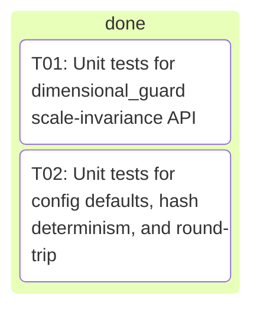
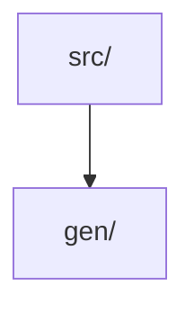

# _integration — Project Portfolio

> Auto-generated project-management portfolio: board, decisions, metrics, architecture and changelog at a glance.

## Board

| Status | Count |
| --- | --- |
| done | 2 |

## Roadmap / Tasks

| Task | Title | Status | Owner | Kind |
| --- | --- | --- | --- | --- |
| T01 | Unit tests for dimensional_guard scale-invariance API | done | claude | feature |
| T02 | Unit tests for config defaults, hash determinism, and round-trip | done | claude | feature |

## Decisions

- (2026-06-21) Split strictly by module (dfm vs flight); the two source files share no imports and each has its own test file, so parallel worktrees never touch the same path — zero collision risk.
- (2026-06-21) Keep each module's regression test in the SAME task as the module (test imports the module under review), so each task is independently verifiable in its own worktree per the isolation requirement.
- (2026-06-21) Flag for the flight task a concrete suspected defect to verify: rotor_hover_check's docstring promises 'Raises ValueError on ... a negative thrust' but no guard validates max_total_thrust (induced_velocity only ever sees the always-positive per-rotor hover thrust weight/n_rotors), so a negative max_total_thrust silently yields a negative thrust-weight ratio instead of failing loud — an L2-drift/L4-edge bug consistent with the no-silent-defaults principle. Builder must confirm and, if real, add the missing non-negative guard plus a regression test, without altering any passing behavior.
- (2026-06-21) Honor 'change nothing if correct': dfm.py is mostly grounded reference constants + gap-declaration strings; only min_wall_formula and ipc2221_trace_width_mm carry live math (verify the IPC-2221 inversion A=(I/(k·ΔT^0.44))^(1/0.725), the mil→mm 0.0254 factor, and the fail-loud guards) — if all check out, the dfm task makes no source edits and only documents the clean review.
- (2026-06-21) Edge-case review (L4) is scoped to genuine correctness gaps (non-finite/NaN inputs that bypass <=0 guards, boundary ratios, empty lists, unit consistency) — builders add NaN/inf guards ONLY where their absence is a real defect that produces a wrong/silent factual value, not as blanket feature-creep.
- (2026-06-21) Split by module (flight vs dfm): the two source files share no imports and have separate test files (tests/test_flight.py, tests/test_dfm.py), so parallel worktrees never touch the same path — zero collision risk.
- (2026-06-21) flight.py has ONE confirmed real bug: rotor_hover_check's docstring promises 'Raises ValueError on ... a negative thrust' but max_total_thrust is never validated (induced_velocity only ever sees the always-positive per-rotor hover thrust weight/n_rotors), so a negative max_total_thrust silently yields a negative thrust_weight_ratio and a misleading safety_factor instead of failing loud — an L2-drift/L4-edge violation of no-silent-defaults. Fix is the minimal guard `if max_total_thrust < 0.0: raise ValueError(...)` matching induced_velocity's `thrust < 0.0` convention (non-negative, since 0 thrust is a meaningful evaluable case → ratio 0, ok False), plus a regression test.
- (2026-06-21) dfm.py is mostly grounded reference constants + gap-declaration strings; the only live math is min_wall_formula (commutative string build, correct) and ipc2221_trace_width_mm — verify the inversion A=(I/(k·ΔT^0.44))^(1/0.725), the width=area/(copper_oz·1.378 mil) step, the mil→mm 0.0254 factor, and the >0 fail-loud guards. Pre-analysis finds all correct, so the dfm task makes NO source edits and only adds a focused regression test asserting the IPC-2221 result against a hand-computed anchor; it edits dfm.py ONLY if it independently confirms a genuine defect.
- (2026-06-21) Keep each regression test in the SAME task as its module (the test imports the module under review) so each task passes using only its own files plus pre-existing repo files — independently verifiable per the isolation requirement.
- (2026-06-21) Edge-case (L4) review is scoped to genuine correctness gaps only; do NOT add blanket NaN/inf guards as feature-creep — only the negative-thrust guard in flight is a real silent-wrong-value defect.
- (2026-06-21) Multi-path installer (pipx → pip --user → python -m venv → docker image fallback) because 'nicht installierbar' usually means one channel is blocked; trying several makes install succeed in restricted environments.
- (2026-06-21) Runner/config task mocks the semgrep binary in its tests (no network, no real binary) so Task B is independently verifiable in its own worktree even if semgrep never installs there — satisfies the 'tests pass using only this task's files' rule.
- (2026-06-21) Keep installer (shell + Makefile) and runner (Python + yaml rules) in separate directories so the two agents never touch the same file.
- (2026-06-21) No changes to existing src/gen pipeline code — semgrep is dev/security tooling, kept under scripts/ and tools/, avoiding collisions with the GENESIS codebase.
- (2026-06-22) Split strictly by module (dimensional_guard vs config): the two source files share no imports and get separate new test files (tests/test_dimensional_guard.py, tests/test_config.py), so parallel worktrees never write the same path — zero collision risk.
- (2026-06-22) Keep each module's test in the SAME task as the module it imports; both tasks add ONLY a new test file and edit no source under src/, satisfying the 'pass using only this task's files plus pre-existing repo files' isolation rule (dimensional_guard's transitive dep verification/units.py already exists in the repo).
- (2026-06-22) For dimensional_guard, drive the API with tiny in-test functions returning {'safety_factor': ...}: a homogeneous ratio fn (allowable/actual, same dimension) must report invariant=True; a non-homogeneous fn (adds a length term to a mass term via mismatched unit strings) must report invariant=False AND make assert_scale_invariant raise DimensionalInconsistencyError — no dependency on any real validator, keeping the task self-contained.
- (2026-06-22) For config, assert config_hash is a stable 64-char hex SHA-256 equal across two independent default Config() builds (determinism) and DIFFERENT after from_dict mutates a field, and that Config().to_dict()/from_dict round-trips to an equal frozen dataclass — testing the documented A5 reproducibility contract, not implementation details.
- (2026-06-22) Edge cases stay scoped to genuine public-API behavior (zero/non-finite base result comparing by exact equality in scale_invariance_report; from_dict's str→1-tuple search_backends coercion; default factory independence), not blanket feature-creep, per the no-silent-defaults convention.

### Architecture Decision Records

- 0001. Deep-review campaign — next modules. Carefully review these
- 0002. Deep-review campaign — next modules. Carefully review these
- 0003. semgrep nicht installierbar  du kannst es installieren
- 0004. Add focused pytest unit tests for two currently-untested mod

## Metrics

| Metric | Value |
| --- | --- |
| Runs | 1 |
| Tasks (total) | 2 |
| Done | 1 |
| Blocked | 0 |
| Resolved rate | 50% |
| Blocked rate | 0% |
| Merges | 0 |
| Avg duration | 553.5m |
| Total cost | 3.52 |

## Architecture

Top-level `src/` modules:

## Changelog

Recent commits:

- `acf71f3 Merge branch 'crew/T02-claude' into crew/integration`
- `a0e3038 crew(claude): T02 Unit tests for config defaults, hash determinism, and round-trip [round 2]`
- `3515729 crew(claude): T02 Unit tests for config defaults, hash determinism, and round-trip [round 1]`
- `284ef5e crew(claude): T01 Unit tests for dimensional_guard scale-invariance API [round 1]`
- `335c4ca Snapshot before crew run (git init: project was unversioned)`

---
_Generated by [crew](https://github.com/) on 2026-06-22. Regenerated each integration._
