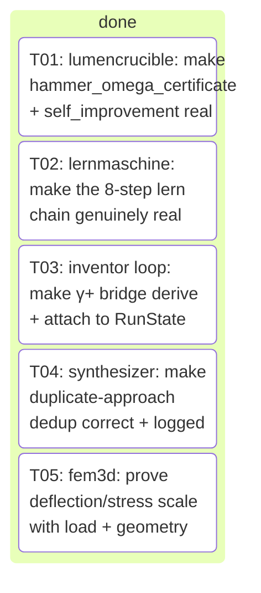
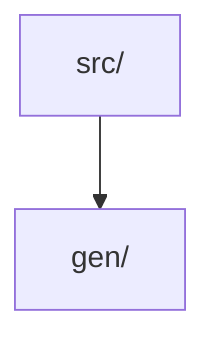

# _integration — Project Portfolio

> Auto-generated project-management portfolio: board, decisions, metrics, architecture and changelog at a glance.

## Board

| Status | Count |
| --- | --- |
| done | 5 |

## Roadmap / Tasks

| Task | Title | Status | Owner | Kind |
| --- | --- | --- | --- | --- |
| T01 | lumencrucible: make hammer_omega_certificate + self_improvement real | done | claude | feature |
| T02 | lernmaschine: make the 8-step lern chain genuinely real | done | claude | feature |
| T03 | inventor loop: make γ+ bridge derive + attach to RunState | done | claude | feature |
| T04 | synthesizer: make duplicate-approach dedup correct + logged | done | claude | feature |
| T05 | fem3d: prove deflection/stress scale with load + geometry | done | claude | feature |

## Decisions

- (2026-06-21) Split strictly by module (dfm vs flight); the two source files share no imports and each has its own test file, so parallel worktrees never touch the same path — zero collision risk.
- (2026-06-21) Keep each module's regression test in the SAME task as the module (test imports the module under review), so each task is independently verifiable in its own worktree per the isolation requirement.
- (2026-06-21) Flag for the flight task a concrete suspected defect to verify: rotor_hover_check's docstring promises 'Raises ValueError on ... a negative thrust' but no guard validates max_total_thrust (induced_velocity only ever sees the always-positive per-rotor hover thrust weight/n_rotors), so a negative max_total_thrust silently yields a negative thrust-weight ratio instead of failing loud — an L2-drift/L4-edge bug consistent with the no-silent-defaults principle. Builder must confirm and, if real, add the missing non-negative guard plus a regression test, without altering any passing behavior.
- (2026-06-21) Honor 'change nothing if correct': dfm.py is mostly grounded reference constants + gap-declaration strings; only min_wall_formula and ipc2221_trace_width_mm carry live math (verify the IPC-2221 inversion A=(I/(k·ΔT^0.44))^(1/0.725), the mil→mm 0.0254 factor, and the fail-loud guards) — if all check out, the dfm task makes no source edits and only documents the clean review.
- (2026-06-21) Edge-case review (L4) is scoped to genuine correctness gaps (non-finite/NaN inputs that bypass <=0 guards, boundary ratios, empty lists, unit consistency) — builders add NaN/inf guards ONLY where their absence is a real defect that produces a wrong/silent factual value, not as blanket feature-creep.
- (2026-06-21) Split by module (flight vs dfm): the two source files share no imports and have separate test files (tests/test_flight.py, tests/test_dfm.py), so parallel worktrees never touch the same path — zero collision risk.
- (2026-06-21) flight.py has ONE confirmed real bug: rotor_hover_check's docstring promises 'Raises ValueError on ... a negative thrust' but max_total_thrust is never validated (induced_velocity only ever sees the always-positive per-rotor hover thrust weight/n_rotors), so a negative max_total_thrust silently yields a negative thrust_weight_ratio and a misleading safety_factor instead of failing loud — an L2-drift/L4-edge violation of no-silent-defaults. Fix is the minimal guard `if max_total_thrust < 0.0: raise ValueError(...)` matching induced_velocity's `thrust < 0.0` convention (non-negative, since 0 thrust is a meaningful evaluable case → ratio 0, ok False), plus a regression test.
- (2026-06-21) dfm.py is mostly grounded reference constants + gap-declaration strings; the only live math is min_wall_formula (commutative string build, correct) and ipc2221_trace_width_mm — verify the inversion A=(I/(k·ΔT^0.44))^(1/0.725), the width=area/(copper_oz·1.378 mil) step, the mil→mm 0.0254 factor, and the >0 fail-loud guards. Pre-analysis finds all correct, so the dfm task makes NO source edits and only adds a focused regression test asserting the IPC-2221 result against a hand-computed anchor; it edits dfm.py ONLY if it independently confirms a genuine defect.
- (2026-06-21) Keep each regression test in the SAME task as its module (the test imports the module under review) so each task passes using only its own files plus pre-existing repo files — independently verifiable per the isolation requirement.
- (2026-06-21) Edge-case (L4) review is scoped to genuine correctness gaps only; do NOT add blanket NaN/inf guards as feature-creep — only the negative-thrust guard in flight is a real silent-wrong-value defect.
- (2026-06-21) Multi-path installer (pipx → pip --user → python -m venv → docker image fallback) because 'nicht installierbar' usually means one channel is blocked; trying several makes install succeed in restricted environments.
- (2026-06-21) Runner/config task mocks the semgrep binary in its tests (no network, no real binary) so Task B is independently verifiable in its own worktree even if semgrep never installs there — satisfies the 'tests pass using only this task's files' rule.
- (2026-06-21) Keep installer (shell + Makefile) and runner (Python + yaml rules) in separate directories so the two agents never touch the same file.
- (2026-06-21) No changes to existing src/gen pipeline code — semgrep is dev/security tooling, kept under scripts/ and tools/, avoiding collisions with the GENESIS codebase.
- (2026-06-22) Split strictly by module (dimensional_guard vs config): the two source files share no imports and get separate new test files (tests/test_dimensional_guard.py, tests/test_config.py), so parallel worktrees never write the same path — zero collision risk.
- (2026-06-22) Keep each module's test in the SAME task as the module it imports; both tasks add ONLY a new test file and edit no source under src/, satisfying the 'pass using only this task's files plus pre-existing repo files' isolation rule (dimensional_guard's transitive dep verification/units.py already exists in the repo).
- (2026-06-22) For dimensional_guard, drive the API with tiny in-test functions returning {'safety_factor': ...}: a homogeneous ratio fn (allowable/actual, same dimension) must report invariant=True; a non-homogeneous fn (adds a length term to a mass term via mismatched unit strings) must report invariant=False AND make assert_scale_invariant raise DimensionalInconsistencyError — no dependency on any real validator, keeping the task self-contained.
- (2026-06-22) For config, assert config_hash is a stable 64-char hex SHA-256 equal across two independent default Config() builds (determinism) and DIFFERENT after from_dict mutates a field, and that Config().to_dict()/from_dict round-trips to an equal frozen dataclass — testing the documented A5 reproducibility contract, not implementation details.
- (2026-06-22) Edge cases stay scoped to genuine public-API behavior (zero/non-finite base result comparing by exact equality in scale_invariance_report; from_dict's str→1-tuple search_backends coercion; default factory independence), not blanket feature-creep, per the no-silent-defaults convention.
- (2026-06-22) Split strictly by module (reality vs frontier): the two source files share no imports beyond core.state, and each gets its own brand-new test file, so parallel worktrees never write the same path — zero collision risk.
- (2026-06-22) Keep each module's test in the SAME task as the module it imports; both tasks add ONLY a new test file under tests/ and edit no source, satisfying the 'pass using only this task's files plus pre-existing repo files' isolation rule (the transitive deps core/state.py, core/errors.py, core/interfaces.py, verification/units.py already exist in the repo).
- (2026-06-22) For reality, exercise all four evaluate_reality verdicts (CORROBORATED within tolerance, REFUTED outside, INCONCLUSIVE on dimension mismatch / non-retrieved provenance / non-finite / unparseable unit) plus the unit-scale conversion path (measured value rescaled into the predicted unit), and gate_delta_plus's four codes (GROUNDING_UNKNOWN_CLAIM, EXPERIMENT_MISMATCH, UNSOURCED/DEAD source) — testing the documented HORIZON §2B contract, not implementation details.
- (2026-06-22) For frontier, assert build_frontier_map emits one KnownRegion only for VERIFIED claims with confidence >= threshold that are actually USED (report/solution/spec), produces FrontierEdges for non-empty surfaced gaps and for REFUTED/UNSUPPORTED claims while skipping whitespace-only gaps, and is deterministic (same RunState -> identical FrontierMap) per the A5 reproducibility contract.
- (2026-06-22) Builders must construct state objects through the real constructors in core/state.py (reading actual field/enum names rather than inventing them) and abstain from any new dependency — stdlib + the project's declared deps only.
- (2026-06-22) Edge cases stay scoped to genuine public-API behavior (zero/exact-boundary residual == tolerance, empty claim/gap lists, confidence exactly at threshold, unretrieved source rejection), not blanket feature-creep, per the no-silent-defaults convention.
- (2026-06-22) Excluded reality.py and frontier.py despite being untested on main: the 2026-06-22 team decision log already planned brand-new test files for both, so re-planning them would collide with in-flight work — picked three modules absent from that log instead.
- (2026-06-22) Split strictly by module (memory_fabric vs coverage vs inverse_design); the three source files share no mutual imports (only common lightweight internals core.state/core.interfaces) and each gets a distinct new test file, so parallel worktrees never write the same path — zero collision risk.
- (2026-06-22) Each task adds ONLY a new tests/test_<module>.py and edits no src/ file; all transitive deps (core.state, core.interfaces, core.errors, physics_selection, verification.constraint_smt, pipeline, verification.units/derivation/gates) already exist in the repo, satisfying the 'pass using only this task's files plus pre-existing repo files' isolation rule.
- (2026-06-22) Builders must construct state/spec objects through the REAL constructors and enum names in src/gen/core/state.py (read them, never invent fields), and use only stdlib + the project's declared deps — no new dependency.
- (2026-06-22) Tests must exercise both the happy path AND the documented fail-loud guards (ValueError/gate-failure codes), asserting the exact GateFailure.code strings and ValueError messages so a regression in the guard fails the test — per the no-silent-defaults principle and 'a gate without a test does not exist'.
- (2026-06-22) For coverage, the z3-dependent constraint path is optional: tests target the always-available mechanical paths (empty-spec → empty requirements, physics-recipe measurand filtering, complete-certificate gate, UNDECLARED_FAILURE_MODE) and treat the SMT/UNTESTABLE branch as an accepted fallback rather than requiring z3-solver to be installed.
- (2026-06-22) Edge cases stay scoped to genuine public-API behavior (empty inputs, boundary confidence/tolerance equal-to-threshold, duplicate detection, unit mismatch, run-id mismatch, non-finite values), not blanket feature-creep guards — matching the project's existing test conventions.
- (2026-06-22) Determinism is asserted where the contract promises it (build_memory_fabric_certificate / build_pareto_front produce identical output for identical input; certificate.run_id == state.question.run_id), upholding the A5 reproducibility principle.
- (2026-06-22) Picked reality.py, memory_fabric.py, frontier.py because they are pure/deterministic, have NO dedicated test_<module>.py, are individually important (they implement GATE δ⁺/ζ/χ), and have rich branch logic (multiple distinct failure codes + verdict paths) that rewards thorough unit testing.
- (2026-06-22) Excluded infra modules (llm/* adapters, tools/http) — they need network/subprocess mocking and would be brittle; the chosen modules are deterministic and test cleanly with hand-built core.state objects.
- (2026-06-22) One module ⇒ one new test file ⇒ one task: each task's tests import only its target module plus pre-existing src/gen + core.state, so it passes standalone in its own worktree with zero cross-task dependency.
- (2026-06-22) Builders must NOT modify any file under src/gen/; tests construct inputs via the existing core.state dataclasses (read their real field names from src/gen/core/state.py).
- (2026-06-22) Split strictly by module across two disjoint facade-risk layers (grenzverschiebung/* boundary modules and pipelines/* domain pipelines); the chosen source files share no mutual imports beyond lightweight core.state/core.interfaces, and each task adds a uniquely-named tests/test_<module>.py plus docs/audit/DEPTH_AUDIT_<module>.md — zero path collision across worktrees.
- (2026-06-22) Each task adds ONLY a new test file and a new audit doc; it edits its OWN single source module ONLY if it independently confirms a genuine defect (silent wrong/constant value, missing documented guard, dead input that never affects output) — never blanket feature-creep — upholding the project's 'change nothing if correct' and 'keine stillen Defaults' conventions.
- (2026-06-22) Every test must be a real facade-detector, not a smoke test: at minimum assert (a) output changes meaningfully when a driving input changes — proving the input is actually consumed, and (b) the documented fail-loud path raises the exact error/gate code — proving guards exist; per 'a gate without a test does not exist'.
- (2026-06-22) Picked technology_builder, experiment_designer, safety_ladder, milestone_builder (grenzverschiebung) and ingenieur, elektriker (pipelines) because all six lack a dedicated test_<module>.py on main, are named in the platform-plan backlog as boundary/domain capabilities, and are the highest facade-risk (claimed 'built' but unverified for real input-depth).
- (2026-06-22) Builders MUST construct inputs through the REAL constructors/enum names in src/gen/core/state.py and the module's real signatures (read them, never invent fields), and use only stdlib + the project's already-declared deps — no new dependency — keeping each task self-contained and deterministic.
- (2026-06-22) The DEPTH_AUDIT doc per module must state an explicit verdict (REAL / PARTIAL-FACADE / FACADE) with concrete evidence (which inputs are genuinely consumed, which outputs are computed vs hardcoded, which backlog .md item it satisfies or leaves open), so the loop produces a cumulative honest map of what truly works.
- (2026-06-22) Split strictly by module: the five source files share no mutual imports beyond pre-existing core/* helpers, and each task adds a uniquely-named tests/test_*_<aspect>.py — zero path collision across worktrees.
- (2026-06-22) Each task creates a NEW characterization test rather than editing the existing deselected test, so the new test is the authoritative pass/fail signal the builder drives to green while leaving the legacy test files untouched (no churn).
- (2026-06-22) Tests call the real upstream collaborators (build_full_mini_realization_package, scripted_council/architect, evaluate_reality, build_pareto_front, real ScriptedLLM payloads) as pre-existing repo files — these are allowed because the rule forbids mocking only the module UNDER test, and importing pre-existing modules is permitted under the isolation rule.
- (2026-06-22) Source edits are confined to the module's own files; if a failure's true root cause lies in a cross-module collaborator (e.g. lernmaschine's e2e depends on integrator STL emission), the builder fixes only the wiring it owns and documents the external remainder under docs/audit/ rather than touching another module.
- (2026-06-22) fem3d's core tet solver is already real (uniform-stress exact tests pass); its task's value is a public load+geometry helper plus a scaling-law characterization test (linearity in load, L/A geometry scaling) that proves the numbers are computed, not canned — a real improvement on top of a real solver.
- (2026-06-22) synthesizer's dedup already logs drops, but the deselected test exposes a real bug: a third proposal whose only distinguishing tradeoff id ('c-extra') is unverified gets its tradeoffs stripped, collapsing its dedup id into the first → only 1 approach instead of 2; the fix must make the dedup identity reflect the approach's presented distinguishing fields so a genuinely-different proposal survives, without weakening grounding validation.
- (2026-06-22) preferredBuilder=claude on the cleanly-deterministic test-centric tasks (fem3d, synthesizer, inventor_loop) per the test→claude routing; left null on the two large debugging-surface tasks (lumencrucible, lernmaschine) where no clear leader applies.
- (2026-06-22) Split strictly by module across 5 disjoint source paths (grenzverschiebung/lumencrucible.py, lernmaschine/engine.py, inventor/loop.py, agents/synthesizer.py, fem3d.py); they share no mutual imports beyond lightweight core/* helpers, and each task adds a uniquely-named tests/test_*_characterization.py + docs/audit/DEPTH_AUDIT_<module>.md — zero path collision across worktrees.
- (2026-06-22) Note the real path of the inventor task is src/gen/inventor/loop.py (NOT src/gen/inventor_loop.py as the brief abbreviates) — the loop lives in the inventor package.
- (2026-06-22) Each task creates a NEW characterization test rather than editing the existing deselected legacy test, so the new file is the authoritative pass/fail signal the builder drives to green while leaving legacy test files untouched (no churn) — consistent with the 2026-06-22 team decision.
- (2026-06-22) Tests may call pre-existing upstream collaborators (build_full_mini_realization_package, scripted_council/architect, evaluate_reality, build_pareto_front, ScriptedLLM payloads, solve_elasticity) as real wiring — the isolation rule forbids mocking only the module UNDER test; importing pre-existing repo modules is allowed.
- (2026-06-22) synthesizer dedup root cause is confirmed: the third proposal's only distinguishing field is an UNVERIFIED tradeoff id ('c-extra') that gets stripped, collapsing its dedup id into the first → 1 approach instead of 2; the fix must make the dedup identity reflect the approach's PRESENTED distinguishing fields (so a genuinely-different proposal survives) while the emitted Approach still carries only VERIFIED grounding/tradeoffs — never weaken grounding validation.
- (2026-06-22) fem3d's tet solver is already real (uniform-stress exact tests pass on main), so its task's value is a scaling-law characterization test proving deflection/stress scale linearly with load and with L/A geometry (numbers are computed, not canned), plus any minimal public load/geometry helper needed to drive it.
- (2026-06-22) lernmaschine's e2e transitively depends on integrator STL emission (a different module); the builder fixes ONLY the lern-chain wiring engine.py owns (8 real steps, real delta, persisted_key, apply-to-frontier/realization) and documents any external STL remainder under docs/audit/ rather than touching integrator.
- (2026-06-22) Source edits are confined to each module's own files; if a complete fix is too large for one task, ship a real verifiable improvement with the new test proving the new behavior and record what remains under docs/audit/.
- (2026-06-22) preferredBuilder=claude on the cleanly-deterministic test-centric tasks (fem3d, synthesizer, inventor_loop) per test→claude routing; left null on the two large debugging-surface tasks (lumencrucible, lernmaschine) where no clear leader applies.

### Architecture Decision Records

- 0001. Deep-review campaign — next modules. Carefully review these
- 0002. Deep-review campaign — next modules. Carefully review these
- 0003. semgrep nicht installierbar  du kannst es installieren
- 0004. Add focused pytest unit tests for two currently-untested mod
- 0005. Add focused pytest unit tests for two currently-untested mod
- 0006. Improve test coverage across the genesis engine: pick 3 impo
- 0007. Improve test coverage across the genesis engine: pick 3 impo
- 0008. /home/genesis/genesis wir arbeiten an genesis wir prüfen ob
- 0009. Depth-audit AND FIX — wave 2. For each module below the job
- 0010. Depth-audit AND FIX — wave 2. For each module below the job

## Metrics

| Metric | Value |
| --- | --- |
| Runs | 3 |
| Tasks (total) | 7 |
| Done | 6 |
| Blocked | 0 |
| Resolved rate | 86% |
| Blocked rate | 0% |
| Merges | 2 |
| Avg duration | 206.7m |
| Total cost | 13.83 |

## Architecture

Top-level `src/` modules:

## Changelog

Recent commits:

- `81931a4 Merge branch 'crew/T05-claude' into crew/integration`
- `d75d4a2 Merge branch 'crew/T04-claude' into crew/integration`
- `93148fe Merge branch 'crew/T03-claude' into crew/integration`
- `f0c3ae0 Merge branch 'crew/T02-claude' into crew/integration`
- `66b6c33 crew(claude): T02 lernmaschine: make the 8-step lern chain genuinely real [round 1]`
- `57c261a crew(claude): T01 lumencrucible: make hammer_omega_certificate + self_improvement real [round 1]`
- `d5f3aed crew(claude): T05 fem3d: prove deflection/stress scale with load + geometry [round 1]`
- `6a57326 crew(claude): T04 synthesizer: make duplicate-approach dedup correct + logged [round 1]`
- `5ae9af2 crew(claude): T03 inventor loop: make γ+ bridge derive + attach to RunState [round 1]`
- `6ac5f62 fix(simulation): repair broken module docstring in runner.py (SyntaxError blocked all imports)`
- `629c43e Merge branch 'crew/integration'`
- `6452ac5 crew: scaffold CI/CD + project config`
- `cc63f28 Merge branch 'crew/T03-claude' into crew/integration`
- `228a904 Merge branch 'crew/T02-claude' into crew/integration`
- `9ea0cac crew(claude): T02 Unit tests for memory_fabric.py (GATE ζ shared-memory fabric) [round 1]`
- `069999a crew(claude): T03 Unit tests for frontier.py (GATE χ frontier map) [round 1]`
- `880be4b crew(claude): T01 Unit tests for reality.py (GATE δ⁺ reality proof) [round 1]`
- `71ac19c Remove inappropriate Docker/deploy scaffolding (genesis is a research library/CLI, not a deployable web service)`
- `acadfe9 Merge branch 'crew/integration'`
- `ebf66f9 crew: scaffold CI/CD + project config`

---
_Generated by [crew](https://github.com/) on 2026-06-22. Regenerated each integration._
