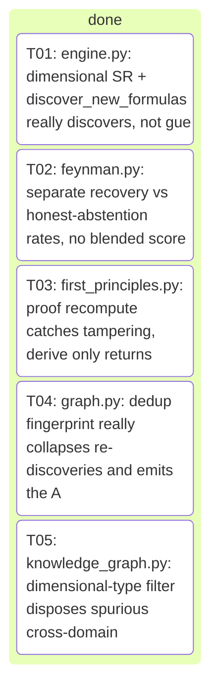
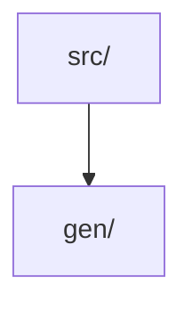

# _integration — Project Portfolio

> Auto-generated project-management portfolio: board, decisions, metrics, architecture and changelog at a glance.

## Board

| Status | Count |
| --- | --- |
| done | 5 |

## Roadmap / Tasks

| Task | Title | Status | Owner | Kind |
| --- | --- | --- | --- | --- |
| T01 | engine.py: dimensional SR + discover_new_formulas really discovers, not guesses | done | claude | feature |
| T02 | feynman.py: separate recovery vs honest-abstention rates, no blended score | done | grok | feature |
| T03 | first_principles.py: proof recompute catches tampering, derive only returns verified proofs | done | grok | feature |
| T04 | graph.py: dedup fingerprint really collapses re-discoveries and emits the Anhang-C record | done | claude | feature |
| T05 | knowledge_graph.py: dimensional-type filter disposes spurious cross-domain groupings | done | grok | feature |

## Decisions

- (2026-06-21) Split strictly by module (dfm vs flight); the two source files share no imports and each has its own test file, so parallel worktrees never touch the same path — zero collision risk.
- (2026-06-21) Keep each module's regression test in the SAME task as the module (test imports the module under review), so each task is independently verifiable in its own worktree per the isolation requirement.
- (2026-06-21) Flag for the flight task a concrete suspected defect to verify: rotor_hover_check's docstring promises 'Raises ValueError on ... a negative thrust' but no guard validates max_total_thrust (induced_velocity only ever sees the always-positive per-rotor hover thrust weight/n_rotors), so a negative max_total_thrust silently yields a negative thrust-weight ratio instead of failing loud — an L2-drift/L4-edge bug consistent with the no-silent-defaults principle. Builder must confirm and, if real, add the missing non-negative guard plus a regression test, without altering any passing behavior.
- (2026-06-21) Honor 'change nothing if correct': dfm.py is mostly grounded reference constants + gap-declaration strings; only min_wall_formula and ipc2221_trace_width_mm carry live math (verify the IPC-2221 inversion A=(I/(k·ΔT^0.44))^(1/0.725), the mil→mm 0.0254 factor, and the fail-loud guards) — if all check out, the dfm task makes no source edits and only documents the clean review.
- (2026-06-21) Edge-case review (L4) is scoped to genuine correctness gaps (non-finite/NaN inputs that bypass <=0 guards, boundary ratios, empty lists, unit consistency) — builders add NaN/inf guards ONLY where their absence is a real defect that produces a wrong/silent factual value, not as blanket feature-creep.
- (2026-06-21) Split by module (flight vs dfm): the two source files share no imports and have separate test files (tests/test_flight.py, tests/test_dfm.py), so parallel worktrees never touch the same path — zero collision risk.
- (2026-06-21) flight.py has ONE confirmed real bug: rotor_hover_check's docstring promises 'Raises ValueError on ... a negative thrust' but max_total_thrust is never validated (induced_velocity only ever sees the always-positive per-rotor hover thrust weight/n_rotors), so a negative max_total_thrust silently yields a negative thrust_weight_ratio and a misleading safety_factor instead of failing loud — an L2-drift/L4-edge violation of no-silent-defaults. Fix is the minimal guard `if max_total_thrust < 0.0: raise ValueError(...)` matching induced_velocity's `thrust < 0.0` convention (non-negative, since 0 thrust is a meaningful evaluable case → ratio 0, ok False), plus a regression test.
- (2026-06-21) dfm.py is mostly grounded reference constants + gap-declaration strings; the only live math is min_wall_formula (commutative string build, correct) and ipc2221_trace_width_mm — verify the inversion A=(I/(k·ΔT^0.44))^(1/0.725), the width=area/(copper_oz·1.378 mil) step, the mil→mm 0.0254 factor, and the >0 fail-loud guards. Pre-analysis finds all correct, so the dfm task makes NO source edits and only adds a focused regression test asserting the IPC-2221 result against a hand-computed anchor; it edits dfm.py ONLY if it independently confirms a genuine defect.
- (2026-06-21) Keep each regression test in the SAME task as its module (the test imports the module under review) so each task passes using only its own files plus pre-existing repo files — independently verifiable per the isolation requirement.
- (2026-06-21) Edge-case (L4) review is scoped to genuine correctness gaps only; do NOT add blanket NaN/inf guards as feature-creep — only the negative-thrust guard in flight is a real silent-wrong-value defect.
- (2026-06-21) Multi-path installer (pipx → pip --user → python -m venv → docker image fallback) because 'nicht installierbar' usually means one channel is blocked; trying several makes install succeed in restricted environments.
- (2026-06-21) Runner/config task mocks the semgrep binary in its tests (no network, no real binary) so Task B is independently verifiable in its own worktree even if semgrep never installs there — satisfies the 'tests pass using only this task's files' rule.
- (2026-06-21) Keep installer (shell + Makefile) and runner (Python + yaml rules) in separate directories so the two agents never touch the same file.
- (2026-06-21) No changes to existing src/gen pipeline code — semgrep is dev/security tooling, kept under scripts/ and tools/, avoiding collisions with the GENESIS codebase.
- (2026-06-22) Split strictly by module (dimensional_guard vs config): the two source files share no imports and get separate new test files (tests/test_dimensional_guard.py, tests/test_config.py), so parallel worktrees never write the same path — zero collision risk.
- (2026-06-22) Keep each module's test in the SAME task as the module it imports; both tasks add ONLY a new test file and edit no source under src/, satisfying the 'pass using only this task's files plus pre-existing repo files' isolation rule (dimensional_guard's transitive dep verification/units.py already exists in the repo).
- (2026-06-22) For dimensional_guard, drive the API with tiny in-test functions returning {'safety_factor': ...}: a homogeneous ratio fn (allowable/actual, same dimension) must report invariant=True; a non-homogeneous fn (adds a length term to a mass term via mismatched unit strings) must report invariant=False AND make assert_scale_invariant raise DimensionalInconsistencyError — no dependency on any real validator, keeping the task self-contained.
- (2026-06-22) For config, assert config_hash is a stable 64-char hex SHA-256 equal across two independent default Config() builds (determinism) and DIFFERENT after from_dict mutates a field, and that Config().to_dict()/from_dict round-trips to an equal frozen dataclass — testing the documented A5 reproducibility contract, not implementation details.
- (2026-06-22) Edge cases stay scoped to genuine public-API behavior (zero/non-finite base result comparing by exact equality in scale_invariance_report; from_dict's str→1-tuple search_backends coercion; default factory independence), not blanket feature-creep, per the no-silent-defaults convention.
- (2026-06-22) Split strictly by module (reality vs frontier): the two source files share no imports beyond core.state, and each gets its own brand-new test file, so parallel worktrees never write the same path — zero collision risk.
- (2026-06-22) Keep each module's test in the SAME task as the module it imports; both tasks add ONLY a new test file under tests/ and edit no source, satisfying the 'pass using only this task's files plus pre-existing repo files' isolation rule (the transitive deps core/state.py, core/errors.py, core/interfaces.py, verification/units.py already exist in the repo).
- (2026-06-22) For reality, exercise all four evaluate_reality verdicts (CORROBORATED within tolerance, REFUTED outside, INCONCLUSIVE on dimension mismatch / non-retrieved provenance / non-finite / unparseable unit) plus the unit-scale conversion path (measured value rescaled into the predicted unit), and gate_delta_plus's four codes (GROUNDING_UNKNOWN_CLAIM, EXPERIMENT_MISMATCH, UNSOURCED/DEAD source) — testing the documented HORIZON §2B contract, not implementation details.
- (2026-06-22) For frontier, assert build_frontier_map emits one KnownRegion only for VERIFIED claims with confidence >= threshold that are actually USED (report/solution/spec), produces FrontierEdges for non-empty surfaced gaps and for REFUTED/UNSUPPORTED claims while skipping whitespace-only gaps, and is deterministic (same RunState -> identical FrontierMap) per the A5 reproducibility contract.
- (2026-06-22) Builders must construct state objects through the real constructors in core/state.py (reading actual field/enum names rather than inventing them) and abstain from any new dependency — stdlib + the project's declared deps only.
- (2026-06-22) Edge cases stay scoped to genuine public-API behavior (zero/exact-boundary residual == tolerance, empty claim/gap lists, confidence exactly at threshold, unretrieved source rejection), not blanket feature-creep, per the no-silent-defaults convention.
- (2026-06-22) Excluded reality.py and frontier.py despite being untested on main: the 2026-06-22 team decision log already planned brand-new test files for both, so re-planning them would collide with in-flight work — picked three modules absent from that log instead.
- (2026-06-22) Split strictly by module (memory_fabric vs coverage vs inverse_design); the three source files share no mutual imports (only common lightweight internals core.state/core.interfaces) and each gets a distinct new test file, so parallel worktrees never write the same path — zero collision risk.
- (2026-06-22) Each task adds ONLY a new tests/test_<module>.py and edits no src/ file; all transitive deps (core.state, core.interfaces, core.errors, physics_selection, verification.constraint_smt, pipeline, verification.units/derivation/gates) already exist in the repo, satisfying the 'pass using only this task's files plus pre-existing repo files' isolation rule.
- (2026-06-22) Builders must construct state/spec objects through the REAL constructors and enum names in src/gen/core/state.py (read them, never invent fields), and use only stdlib + the project's declared deps — no new dependency.
- (2026-06-22) Tests must exercise both the happy path AND the documented fail-loud guards (ValueError/gate-failure codes), asserting the exact GateFailure.code strings and ValueError messages so a regression in the guard fails the test — per the no-silent-defaults principle and 'a gate without a test does not exist'.
- (2026-06-22) For coverage, the z3-dependent constraint path is optional: tests target the always-available mechanical paths (empty-spec → empty requirements, physics-recipe measurand filtering, complete-certificate gate, UNDECLARED_FAILURE_MODE) and treat the SMT/UNTESTABLE branch as an accepted fallback rather than requiring z3-solver to be installed.
- (2026-06-22) Edge cases stay scoped to genuine public-API behavior (empty inputs, boundary confidence/tolerance equal-to-threshold, duplicate detection, unit mismatch, run-id mismatch, non-finite values), not blanket feature-creep guards — matching the project's existing test conventions.
- (2026-06-22) Determinism is asserted where the contract promises it (build_memory_fabric_certificate / build_pareto_front produce identical output for identical input; certificate.run_id == state.question.run_id), upholding the A5 reproducibility principle.
- (2026-06-22) Picked reality.py, memory_fabric.py, frontier.py because they are pure/deterministic, have NO dedicated test_<module>.py, are individually important (they implement GATE δ⁺/ζ/χ), and have rich branch logic (multiple distinct failure codes + verdict paths) that rewards thorough unit testing.
- (2026-06-22) Excluded infra modules (llm/* adapters, tools/http) — they need network/subprocess mocking and would be brittle; the chosen modules are deterministic and test cleanly with hand-built core.state objects.
- (2026-06-22) One module ⇒ one new test file ⇒ one task: each task's tests import only its target module plus pre-existing src/gen + core.state, so it passes standalone in its own worktree with zero cross-task dependency.
- (2026-06-22) Builders must NOT modify any file under src/gen/; tests construct inputs via the existing core.state dataclasses (read their real field names from src/gen/core/state.py).
- (2026-06-22) Split strictly by module across two disjoint facade-risk layers (grenzverschiebung/* boundary modules and pipelines/* domain pipelines); the chosen source files share no mutual imports beyond lightweight core.state/core.interfaces, and each task adds a uniquely-named tests/test_<module>.py plus docs/audit/DEPTH_AUDIT_<module>.md — zero path collision across worktrees.
- (2026-06-22) Each task adds ONLY a new test file and a new audit doc; it edits its OWN single source module ONLY if it independently confirms a genuine defect (silent wrong/constant value, missing documented guard, dead input that never affects output) — never blanket feature-creep — upholding the project's 'change nothing if correct' and 'keine stillen Defaults' conventions.
- (2026-06-22) Every test must be a real facade-detector, not a smoke test: at minimum assert (a) output changes meaningfully when a driving input changes — proving the input is actually consumed, and (b) the documented fail-loud path raises the exact error/gate code — proving guards exist; per 'a gate without a test does not exist'.
- (2026-06-22) Picked technology_builder, experiment_designer, safety_ladder, milestone_builder (grenzverschiebung) and ingenieur, elektriker (pipelines) because all six lack a dedicated test_<module>.py on main, are named in the platform-plan backlog as boundary/domain capabilities, and are the highest facade-risk (claimed 'built' but unverified for real input-depth).
- (2026-06-22) Builders MUST construct inputs through the REAL constructors/enum names in src/gen/core/state.py and the module's real signatures (read them, never invent fields), and use only stdlib + the project's already-declared deps — no new dependency — keeping each task self-contained and deterministic.
- (2026-06-22) The DEPTH_AUDIT doc per module must state an explicit verdict (REAL / PARTIAL-FACADE / FACADE) with concrete evidence (which inputs are genuinely consumed, which outputs are computed vs hardcoded, which backlog .md item it satisfies or leaves open), so the loop produces a cumulative honest map of what truly works.
- (2026-06-22) Split strictly by module: the five source files share no mutual imports beyond pre-existing core/* helpers, and each task adds a uniquely-named tests/test_*_<aspect>.py — zero path collision across worktrees.
- (2026-06-22) Each task creates a NEW characterization test rather than editing the existing deselected test, so the new test is the authoritative pass/fail signal the builder drives to green while leaving the legacy test files untouched (no churn).
- (2026-06-22) Tests call the real upstream collaborators (build_full_mini_realization_package, scripted_council/architect, evaluate_reality, build_pareto_front, real ScriptedLLM payloads) as pre-existing repo files — these are allowed because the rule forbids mocking only the module UNDER test, and importing pre-existing modules is permitted under the isolation rule.
- (2026-06-22) Source edits are confined to the module's own files; if a failure's true root cause lies in a cross-module collaborator (e.g. lernmaschine's e2e depends on integrator STL emission), the builder fixes only the wiring it owns and documents the external remainder under docs/audit/ rather than touching another module.
- (2026-06-22) fem3d's core tet solver is already real (uniform-stress exact tests pass); its task's value is a public load+geometry helper plus a scaling-law characterization test (linearity in load, L/A geometry scaling) that proves the numbers are computed, not canned — a real improvement on top of a real solver.
- (2026-06-22) synthesizer's dedup already logs drops, but the deselected test exposes a real bug: a third proposal whose only distinguishing tradeoff id ('c-extra') is unverified gets its tradeoffs stripped, collapsing its dedup id into the first → only 1 approach instead of 2; the fix must make the dedup identity reflect the approach's presented distinguishing fields so a genuinely-different proposal survives, without weakening grounding validation.
- (2026-06-22) preferredBuilder=claude on the cleanly-deterministic test-centric tasks (fem3d, synthesizer, inventor_loop) per the test→claude routing; left null on the two large debugging-surface tasks (lumencrucible, lernmaschine) where no clear leader applies.
- (2026-06-22) Split strictly by module across 5 disjoint source paths (grenzverschiebung/lumencrucible.py, lernmaschine/engine.py, inventor/loop.py, agents/synthesizer.py, fem3d.py); they share no mutual imports beyond lightweight core/* helpers, and each task adds a uniquely-named tests/test_*_characterization.py + docs/audit/DEPTH_AUDIT_<module>.md — zero path collision across worktrees.
- (2026-06-22) Note the real path of the inventor task is src/gen/inventor/loop.py (NOT src/gen/inventor_loop.py as the brief abbreviates) — the loop lives in the inventor package.
- (2026-06-22) Each task creates a NEW characterization test rather than editing the existing deselected legacy test, so the new file is the authoritative pass/fail signal the builder drives to green while leaving legacy test files untouched (no churn) — consistent with the 2026-06-22 team decision.
- (2026-06-22) Tests may call pre-existing upstream collaborators (build_full_mini_realization_package, scripted_council/architect, evaluate_reality, build_pareto_front, ScriptedLLM payloads, solve_elasticity) as real wiring — the isolation rule forbids mocking only the module UNDER test; importing pre-existing repo modules is allowed.
- (2026-06-22) synthesizer dedup root cause is confirmed: the third proposal's only distinguishing field is an UNVERIFIED tradeoff id ('c-extra') that gets stripped, collapsing its dedup id into the first → 1 approach instead of 2; the fix must make the dedup identity reflect the approach's PRESENTED distinguishing fields (so a genuinely-different proposal survives) while the emitted Approach still carries only VERIFIED grounding/tradeoffs — never weaken grounding validation.
- (2026-06-22) fem3d's tet solver is already real (uniform-stress exact tests pass on main), so its task's value is a scaling-law characterization test proving deflection/stress scale linearly with load and with L/A geometry (numbers are computed, not canned), plus any minimal public load/geometry helper needed to drive it.
- (2026-06-22) lernmaschine's e2e transitively depends on integrator STL emission (a different module); the builder fixes ONLY the lern-chain wiring engine.py owns (8 real steps, real delta, persisted_key, apply-to-frontier/realization) and documents any external STL remainder under docs/audit/ rather than touching integrator.
- (2026-06-22) Source edits are confined to each module's own files; if a complete fix is too large for one task, ship a real verifiable improvement with the new test proving the new behavior and record what remains under docs/audit/.
- (2026-06-22) preferredBuilder=claude on the cleanly-deterministic test-centric tasks (fem3d, synthesizer, inventor_loop) per test→claude routing; left null on the two large debugging-surface tasks (lumencrucible, lernmaschine) where no clear leader applies.
- (2026-06-23) Split strictly by module (omega.py / pipelines/integrator.py / verification/cross_model.py / discovery/benchmark.py); these four sources share no mutual imports, and each task adds a uniquely-named tests/test_*_characterization.py — parallel worktrees never write the same path, zero collision risk.
- (2026-06-23) Keep each module and ITS new test in the SAME task (the test imports the module under audit) so each task is independently verifiable in its own worktree using only its own files plus pre-existing repo files (core.state, cad.*, discovery.engine already exist on main).
- (2026-06-23) cross_model facade is confirmed and minimal: _FAMILY_KEYWORDS checks ('gpt',...) before ('codex',) so 'gpt-5.5-codex' matches openai first → returns 'openai' but the contract demands 'codex'; the honest fix is to make any id containing 'codex' resolve to the codex family (precedence over the gpt match) while plain 'gpt-4o' still → openai and every other parametrized case is unchanged.
- (2026-06-23) integrator richer-package must be REAL, not constant: the test must assert that BOM entries, assembly manifest, and the manufacturing docs are DERIVED from the input ideas (changing/adding an idea changes the part count and BOM length), upholding 'keine stillen Defaults' — a constant stub that ignores its input is the facade to kill.
- (2026-06-23) omega cert-chain must be a genuine gate over real upstream certs: drive build_omega_certificate/gate_omega from real δ⁺/γ⁺/ε/ζ/χ/φ certs built by their real builders on one RunState, and assert gate_omega FAILS (exact GateFailure.code) when any required upstream receipt is missing or its run_id mismatches — 'a gate without a test does not exist'.
- (2026-06-23) rediscovery honesty: the answer is NOT leaked today (known_laws=None is passed to discover_new_formulas; expected_exponents is used only for the post-hoc match check), so the task PROVES this rather than rewrites it — a held-out/perturbed-data check (recover exponents from a different/noisier sample of the same law) plus a negative control (mismatched data → not rediscovered) makes the ~100% claim honest and falsifiable; ground the dimensional symbolic-regression honesty in Buckingham-π exactness vs the closed-form dispersion baselines (cf. arXiv:1210.6607 exact relations as the kind of closed form the benchmark must recover, not echo).
- (2026-06-23) Each task edits its module's source ONLY where the new test exposes a genuine defect (cross_model is a real fix; the other three fix only if the characterization test fails — never blanket feature-creep), per 'change nothing if correct'.
- (2026-06-23) Builders construct all state/spec/problem inputs through the REAL constructors and enum names in src/gen/core/state.py and the module's real signatures (read them, never invent fields), and use only stdlib + already-declared deps — no new dependency; numpy is already a declared dep for the discovery task.
- (2026-06-23) preferredBuilder=claude on the two cleanly-deterministic test-centric tasks (cross_model, rediscovery) per test→claude routing; left null on the two large debugging-surface tasks (omega cert chain, integrator package/artifact emission) where no clear leader applies.
- (2026-06-23) Split strictly by module: each task edits exactly ONE source file under src/gen/grenzverschiebung/ and adds one uniquely-named tests/test_<module>_characterization.py + docs/audit/DEPTH_AUDIT_<module>.md — zero path collision across worktrees; the runtime cross-import (boundary_reviser imports development_front) is safe because each worktree carries the unmodified pre-existing dependency.
- (2026-06-23) BUILD_LOG.md is deliberately OUT of every task's scope to avoid a shared-file merge collision; each task's honest verdict + 4-Linsen narrative lives in its own docs/audit/DEPTH_AUDIT_<module>.md instead (the integrator can consolidate into BUILD_LOG at merge).
- (2026-06-23) Task 5 (development_front) MUST NOT change the existing DevelopmentFrontMap / ExperimentleiterSchritt / Grenztyp field or enum signatures — only add behavior — because tasks 2/3/4 construct DevelopmentFrontMap in their tests; keeping the dataclass shape stable keeps the post-merge integration green.
- (2026-06-23) The universal facade-killer per module: assert (a) output changes meaningfully when a driving input field changes (proves the input is consumed, not a constant), and (b) an input with no actionable signal yields an honest empty/abstaining output rather than a fabricated canned result — per 'keine stillen Defaults'.
- (2026-06-23) Every task keeps the rich jetpack branch as a protected regression (one test asserts it still returns its detailed map) so making the generic path real does not silently delete the existing demo behavior — completeness/L3 seam check.
- (2026-06-23) preferredBuilder=claude on all five: each is a cleanly-deterministic characterization-test-plus-fix task with no network/subprocess, matching the test→claude routing; the fix surface is small and self-contained.
- (2026-06-23) Shared root cause across all 5: the generic `else` branch returns a constant independent of input — the facade-killer test asserts (a) two different non-jetpack inputs produce MEANINGFULLY different output (input is consumed) and (b) a signal-free input yields honest abstention (empty/explicit-gap or ValueError), never a fabricated canned result, per 'keine stillen Defaults'.
- (2026-06-23) Each task keeps the rich jetpack branch as a PROTECTED regression: one assertion proves the detailed jetpack output (3 rules / 5 assemblies / 3 stands etc.) is unchanged, so making the generic path real does not silently delete existing demo behavior (L3 seam check).
- (2026-06-23) Strict split by module: each task edits ONE src file + adds ONE tests/test_<module>_characterization.py + ONE docs/audit/DEPTH_AUDIT_<module>.md — zero path collision; cross-module input types are imported as unmodified pre-existing repo files.
- (2026-06-23) BUILD_LOG.md is deliberately OUT of every task's scope to avoid a shared-file merge collision (per 2026-06-23 team decision); each task's honest verdict + 4-Linsen narrative lives in its own docs/audit/DEPTH_AUDIT_<module>.md (integrator consolidates at merge).
- (2026-06-23) Every task must add at least one NEGATIVE test (missing/contradictory input → documented ValueError, or signal-free input → honest empty/gap output) per the genesis DoD and 'a gate without a test does not exist'.
- (2026-06-23) designer's jetpack branch triggers on `"jetpack" in idea or "flug" in idea`, so its generic-path test inputs must avoid both substrings — flagged so the builder's two distinct non-jetpack concepts actually hit the generic branch.
- (2026-06-23) Builders construct all input dataclasses (SafetyStagePlan/SafetyStage, RevisedFrontMap, MilestoneLadder/Milestone, TestStandPlan/TestStandSpec, SystemConcept/AssemblyConcept, IngenieurSpec/FailureMode) via the REAL constructors/field names in their existing modules — never invent fields — and use only stdlib + already-declared deps.
- (2026-06-23) Source edits confined to making the generic branch genuinely input-driven; the jetpack branch and all public dataclass signatures stay byte-stable so downstream importers (e.g. designer→architekt/ingenieur) keep compiling and the full pytest gate stays green.
- (2026-06-23) Split strictly by module (fertigungs / physiker / regulatorik / software / techniker): the five sources share no mutual imports beyond the pre-existing architekt.SystemConcept + ingenieur.IngenieurSpec (+ physiker.PhysikerSpec for techniker), and each task adds a uniquely-named tests/test_<module>_characterization.py + docs/audit/DEPTH_AUDIT_<module>.md — zero path collision across worktrees.
- (2026-06-23) Shared root cause confirmed by reading all five: the generic `else` branch returns content independent of inputs (regulatorik/software/physiker emit a fixed minimal Spec; fertigungs/techniker emit a fixed stub) — the facade-killer test asserts (a) two DIFFERENT non-jetpack inputs produce MEANINGFULLY different output (proves inputs are consumed) and (b) a signal-free/empty input yields honest abstention (explicit gap strings or a documented ValueError), never a fabricated canned fact, per 'keine stillen Defaults'.
- (2026-06-23) The jetpack/flug branch in every module triggers on `'jetpack' in idea or 'flug' in idea` (techniker/physiker also scan main_assemblies names) — so each generic-path test input MUST avoid both substrings AND avoid a 'jetpack' assembly name, flagged so the builder's two distinct concepts actually hit the generic branch.
- (2026-06-23) Each task keeps the rich jetpack branch as a PROTECTED regression: one assertion proves the detailed jetpack output (e.g. fertigungs 2 processes, physiker 4 domains/3 equations, regulatorik 2 norms/2 high risks, software 2 embedded/OTA-rollback, techniker 4 montage steps) is unchanged, so making the generic path real does not silently delete existing demo behavior (L3 seam check).
- (2026-06-23) Builders construct all inputs via the REAL constructors/field names — SystemConcept(source_idea, requirements:[SystemRequirement(text,quelle)], main_assemblies:[AssemblyConcept(name,purpose,interfaces,quelle)], variants, open_decisions, zusammenfassung), IngenieurSpec(source_concept, lastfaelle:[LoadCase], material_hinweise, toleranzen, failure_modes, cad_anforderungen:[str], pruefplan_hinweise, zusammenfassung), PhysikerSpec(...) — read from src/gen/pipelines/architekt.py + ingenieur.py + physiker.py, never invent fields; stdlib + already-declared deps only.
- (2026-06-23) Source edits confined to making the generic branch genuinely input-driven and adding the documented guard; public dataclass signatures and the jetpack branch stay byte-stable so downstream importers (architekt/ingenieur/physiker chain, realize/packager, regulatorik←software seam) keep compiling and the full pytest gate stays green.
- (2026-06-23) BUILD_LOG.md is deliberately OUT of every task's scope to avoid a shared-file merge collision (per the 2026-06-23 team decision); each task's honest verdict + 4-Linsen narrative lives in its own docs/audit/DEPTH_AUDIT_<module>.md (the integrator consolidates into BUILD_LOG at merge).
- (2026-06-23) preferredBuilder=claude on all five: each is a cleanly-deterministic characterization-test-plus-fix task with no network/subprocess, matching the test→claude routing; the fix surface is small and self-contained.
- (2026-06-23) Strict split by module: each task edits exactly ONE src file + adds ONE tests/test_<module>_characterization.py + ONE docs/audit/DEPTH_AUDIT_<module>.md — the five sources share no mutual imports beyond pre-existing engine/architekt/ingenieur/transcendental helpers carried unmodified in each worktree, so parallel worktrees never write the same path.
- (2026-06-23) Keep each module and its new test in the SAME task (the test imports the module under audit) so each task is independently verifiable in its own worktree using only its own files plus pre-existing repo files (engine.py, transcendental.py, architekt.py, ingenieur.py already exist on main).
- (2026-06-23) wirtschaft.py is a confirmed PARTIAL-FACADE: the generic branch returns constant TBD/Lücke content (only the source_idea snippet varies), so the facade-killer asserts two DIFFERENT non-jetpack ideas yield MEANINGFULLY different KostenStruktur/Markt fields (input consumed) AND a signal-free/empty idea yields honest gaps or a documented ValueError, never a fabricated cost — per 'keine stillen Defaults'.
- (2026-06-23) wirtschaft's jetpack branch triggers on `'jetpack' in idee_lower or 'flug' in idee_lower`, so generic-path test inputs MUST avoid both substrings; the jetpack branch and all public dataclass signatures (KostenStruktur/Markt/WirtschaftSpec) stay byte-stable as a protected regression so downstream importers keep compiling.
- (2026-06-23) active_resolution.py is real numpy math: the test proves it by asserting the DecisionSpec changes with the rival pair/data (measure_at, max_divergence are computed not canned), the honest non-discriminating path returns discriminating=False with a 'mehr Daten'-style reason when rivals barely diverge, and the documented guards raise ValueError (None rival, >1 varying input, max_extrapolation<1, degenerate range) — fix source only if a guard is genuinely missing.
- (2026-06-23) active_search.py is real uncertainty-sampling: the test proves selection ORDER is driven by binary entropy (most-uncertain candidate gated first, predict()==0.5 on empty history → entropy 1.0), budget is honored (gate_calls == min(budget,len), exhausted pool stops early), tie-break is the documented lowest-index, output is deterministic across two runs, and budget<0 raises ValueError.
- (2026-06-23) assumption_annihilator.py genuinely re-runs discover_new_formulas with the constant promoted: the test exercises all three honest verdicts on constructed data — a constant that is REALLY a hidden variable → 'promoted', a true constant → 'assumption_held', a marginal gain below the δ-bar → 'insufficient_evidence' — plus the two documented ValueErrors (unknown constant_name, sample-count mismatch); fix source only if a branch is unreachable/wrong.
- (2026-06-23) benchmark.py rediscovery honesty (per the 2026-06-23 team decision): the answer is NOT leaked today (known_laws=None to discover_new_formulas; expected_exponents only post-hoc), so the test PROVES this with a held-out/perturbed-data check (recover exponents from a different/noisier sample of the same law) PLUS a negative control (scrambled/mismatched data → NOT rediscovered), making the ~100% claim falsifiable; also assert red-team cases are caught (widerlegt/unentschieden, never false bestaetigt).
- (2026-06-23) Each task edits its module's source ONLY where the new test exposes a genuine defect (wirtschaft is a real fix; the other four fix only if the characterization test fails — never blanket feature-creep), per 'change nothing if correct'.
- (2026-06-23) Builders construct all state/spec/problem inputs through the REAL constructors and field/enum names in the existing modules (SystemConcept/IngenieurSpec from architekt.py/ingenieur.py; DiscoveryProblem/Variable/Constant from engine.py; RivalForm via transcendental.py's refit/evaluate) — never invent fields — and use only stdlib + already-declared deps (numpy is already declared for the discovery tasks).
- (2026-06-23) preferredBuilder=claude on all five: each is a cleanly-deterministic characterization-test-plus-fix task with no network/subprocess, matching the test→claude routing; the fix surface is small and self-contained.
- (2026-06-23) Split strictly by module (campaign / composition / concept_utility / controller / cosmic_insight); the five sources share no mutual imports beyond pre-existing helpers, and each task adds a uniquely-named tests/test_<module>_characterization.py + docs/audit/DEPTH_AUDIT_<module>.md — zero path collision across worktrees.
- (2026-06-23) Name every new test file with the _characterization suffix because each module already has pre-existing test files (test_campaign.py, test_discovery_composition.py, test_concept_utility.py, test_discovery_controller.py, test_discovery_cosmic_insight.py); the new file is the authoritative facade-detector and leaves legacy tests untouched (no churn).
- (2026-06-23) Universal facade-killer per module: assert (a) the headline output changes MEANINGFULLY when a driving input changes (proves the input is genuinely consumed, not a canned constant) and (b) the documented fail-loud path raises the exact ValueError / honest-abstention output (proves the guard exists) — per 'keine stillen Defaults' and 'a gate without a test does not exist'.
- (2026-06-23) All five modules read as REAL on inspection, so each task edits its source ONLY where the new characterization test exposes a genuine defect (missing guard, silent wrong/constant value, dead input) — never blanket feature-creep — upholding 'change nothing if correct'.
- (2026-06-23) Builders construct every input through the REAL constructors/field names in src/gen/discovery/engine.py, graph.py, knowledge_graph.py, archive.py (DiscoveryProblem/Variable/Constant/Candidate, GraphNode.input_idea/exponent_signature, etc.) — read them, never invent fields — and use only stdlib + already-declared deps (numpy is already declared).
- (2026-06-23) BUILD_LOG.md is out of every task's scope (shared-file merge-collision risk per the standing team decision); each task's honest verdict + 4-Linsen narrative lives in its own docs/audit/DEPTH_AUDIT_<module>.md (integrator consolidates at merge).
- (2026-06-23) preferredBuilder=claude on all five: each is a cleanly-deterministic characterization-test-plus-targeted-fix task with no network/subprocess, matching the test→claude routing.
- (2026-06-23) One module = one task = one new test file, split by module never by file type, so each task is independently verifiable in its own worktree.
- (2026-06-23) engine.py is edited ONLY by Task 1. feynman/graph/knowledge_graph import engine but their tasks must NOT edit engine.py; if they need engine behavior they assert against the existing public API. This prevents the four downstream tasks from colliding on engine.py. dependsOn left empty because each test passes against the repo's current engine.
- (2026-06-23) New test files use a *_audit.py / *_facade.py suffix distinct from the existing test_discovery_engine.py, test_feynman_benchmark.py, test_discovery_first_principles.py, test_discovery_graph.py, test_knowledge_graph.py so no existing test file is touched.
- (2026-06-23) Acceptance criteria are framed as black-box outcomes of the anti-hallucination claim (dimension solve, recompute gate, dedup fingerprint, abstention) so 'green' means the headline really holds, plus a mandatory negative case per module.
- (2026-06-23) Routing: characterization/test-heavy tasks lean claude; all are test+fix so claude is preferred, none are doc-only.

### Architecture Decision Records

- 0001. Deep-review campaign — next modules. Carefully review these
- 0002. Deep-review campaign — next modules. Carefully review these
- 0003. semgrep nicht installierbar  du kannst es installieren
- 0004. Add focused pytest unit tests for two currently-untested mod
- 0005. Add focused pytest unit tests for two currently-untested mod
- 0006. Improve test coverage across the genesis engine: pick 3 impo
- 0007. Improve test coverage across the genesis engine: pick 3 impo
- 0008. /home/genesis/genesis wir arbeiten an genesis wir prüfen ob
- 0009. Depth-audit AND FIX — wave 2. For each module below the job
- 0010. Depth-audit AND FIX — wave 2. For each module below the job
- 0011. Depth-audit AND FIX — wave 3 (continuous). Same rules as bef
- 0012. Depth-audit AND FIX (genesis overnight loop). For each modul
- 0013. Depth-audit AND FIX (genesis overnight loop). For each modul
- 0014. Depth-audit AND FIX (genesis overnight loop). For each modul
- 0015. Depth-audit AND FIX (genesis overnight loop). For each modul
- 0016. Depth-audit AND FIX (genesis overnight loop). For each modul
- 0017. Depth-audit AND FIX (genesis overnight loop). For each modul

## Metrics

| Metric | Value |
| --- | --- |
| Runs | 10 |
| Tasks (total) | 41 |
| Done | 39 |
| Blocked | 1 |
| Resolved rate | 95% |
| Blocked rate | 2% |
| Merges | 9 |
| Avg duration | 87.7m |
| Total cost | 88.3 |

## Architecture

Top-level `src/` modules:

## Changelog

Recent commits:

- `25b2035 crew: resolve merge conflict for crew/T05-grok`
- `b61a957 crew: resolve merge conflict for crew/T03-grok`
- `fcb2b59 Merge branch 'crew/T04-claude' into crew/integration`
- `1b63c8c Merge branch 'crew/T02-grok' into crew/integration`
- `4190bb5 crew(grok): T05 knowledge_graph.py: dimensional-type filter disposes spurious cross-domain groupings [round 1]`
- `faeff2d crew(claude): T04 graph.py: dedup fingerprint really collapses re-discoveries and emits the Anhang-C record [round 1]`
- `60cfee9 crew(grok): T03 first_principles.py: proof recompute catches tampering, derive only returns verified proofs [round 1]`
- `3c07906 crew(claude): T01 engine.py: dimensional SR + discover_new_formulas really discovers, not guesses [round 1]`
- `909b11f crew(grok): T02 feynman.py: separate recovery vs honest-abstention rates, no blended score [round 1]`
- `2073e4f Merge branch 'crew/integration'`
- `3d7b558 crew: scaffold CI/CD + project config`
- `061cb7f crew: resolve merge conflict for crew/T03-grok`
- `2dce3d7 Merge branch 'crew/T05-claude' into crew/integration`
- `516fcd6 Merge branch 'crew/T04-claude' into crew/integration`
- `61d2b3b Merge branch 'crew/T02-grok' into crew/integration`
- `d72a215 crew(claude): T05 Depth-audit + harden cosmic_insight.py (cross-domain structural analogy) [round 1]`
- `5c4b45d crew(claude): T04 Depth-audit + harden controller.py (budget/depth/checkpoint controller) [round 1]`
- `8cde34b crew(grok): T03 Depth-audit + harden concept_utility.py (ledger-learned contrastive prior) [round 1]`
- `d382a01 crew(claude): T01 Depth-audit + harden campaign.py (learned-prior + cross-domain composition) [round 1]`
- `dae5a45 crew(grok): T02 Depth-audit + harden composition.py (minimal-correction discovery) [round 1]`

---
_Generated by [crew](https://github.com/) on 2026-06-23. Regenerated each integration._
